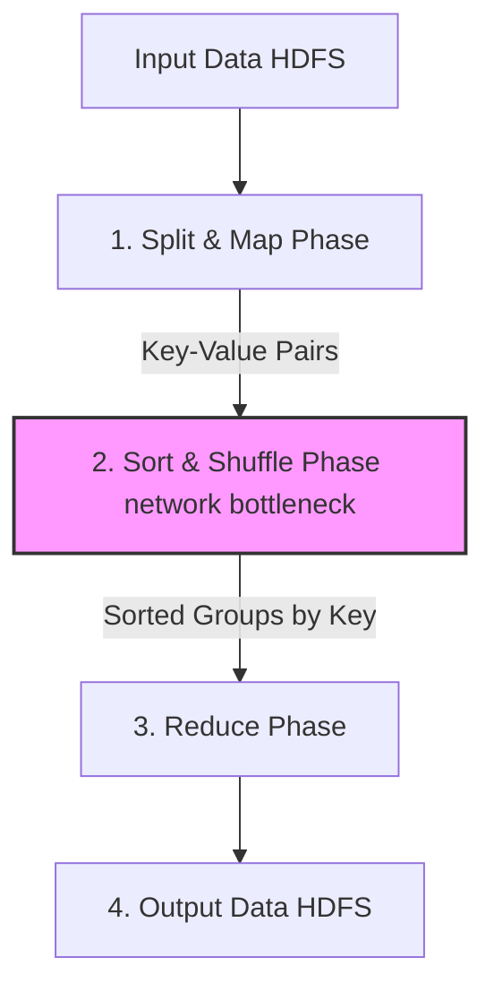

# Chapter 10: Batch Processing (Interview-Grade Deep Dive)

## 🎯 Core Thesis
Batch processing operates on the assumption that data is **bounded** and **static**. The primary goals are maximizing **throughput** (processing the largest volume of data per second) and guaranteeing absolute **fault tolerance** (ensuring a 10-hour offline job does not fail completely due to a single node crash). To defend your analytical architectures in interviews, you must understand the mechanical transitions from the classic **MapReduce** model to modern **dataflow engines (Apache Spark)**, and know how to pick the correct distributed join algorithm based on data size.

---

## 🔑 Key Terminology & Academic Definitions

*   **Batch Processing**: The execution of a series of data transformations over a static, bounded dataset without user interaction.
*   **MapReduce**: A framework for writing parallel data processing jobs that run across massive commodity hardware clusters, popularized by Google.
*   **Shuffle Phase**: The framework step in MapReduce that partitions and transfers intermediate key-value pairs across the network from mappers to the correct reducers.
*   **DAG (Directed Acyclic Graph)**: A logical model of data processing steps where nodes represent operations (map, filter, join) and edges represent data flow, containing no closed loops.
*   **Resilient Distributed Dataset (RDD)**: The baseline abstraction in Apache Spark, representing a read-only, partitioned collection of records that can be reconstructed dynamically if a node fails.
*   **Straggler (Skewed Task)**: A single parallel task in a batch job that runs significantly slower than others (usually due to uneven data partitioning), delaying the entire job's completion.

---

## ⚙️ MapReduce: The Classical Partitioned Pipeline

In a system design interview, if asked how a massive dataset (e.g., billions of search logs) is processed, you must outline the four phases of MapReduce:



### The 4 Phases:
1.  **Split & Map**: Input files are broken into blocks (usually 64MB or 128MB). A Mapper task is spawned on the node holding the physical block. The mapper extracts keys and values.
2.  **Sort & Shuffle**: The framework takes the mapper outputs, sorts them by key, hashes the keys to determine the target reducer, and **transfers them across the network** to the reducer nodes.
    *   *Interview Note*: **This is the primary performance bottleneck.** It saturates wide-area networks and involves heavy disk sorting.
3.  **Reduce**: The Reducer receives all values sharing the exact same key. It performs the aggregation (e.g., sum, count, average) and outputs the result.
4.  **Write Output**: The reducer writes its final output back to a distributed filesystem (HDFS), which replicates the blocks three times across nodes.

#### How MapReduce Achieves Fault Tolerance:
If a Mapper node crashes mid-job, the coordinator simply reschedules the map task on another node holding a replica of that HDFS block. Because **intermediate mapper outputs are written to local disk**, a Reducer node crash only requires re-running the reduce task on the saved mapper files, preventing the entire multi-hour pipeline from needing a restart.

---

## ⚡ Modern Dataflow Engines: Apache Spark

While MapReduce is highly resilient, it is extremely slow for complex pipelines (like machine learning iterations) because every intermediate stage **must write its data entirely to disk** before the next stage can begin.

```text
MapReduce Chain (Slow Disk-Bound):
[Job 1 Map] -> [Disk] -> [Job 1 Reduce] -> [HDFS Disk] -> [Job 2 Map] -> [Disk] -> [Job 2 Reduce]

Spark DAG Chain (Fast Memory-Bound):
[Transform 1] ---> (In-Memory Stream) ---> [Transform 2] ---> (In-Memory Stream) ---> [Action: Save]
```

### Why Apache Spark is 10x-100x Faster:
1.  **DAG Execution Engine**: Spark models the entire pipeline as a single Direct Acyclic Graph. It evaluates transformations lazily. When an action (like `save()`) is called, the Spark Optimizer analyzes the entire DAG and collapses operations (e.g., merging consecutive `map` and `filter` operations into a single step) to minimize data serialization.
2.  **In-Memory Resilient RDDs**: Instead of writing intermediate states to disk, Spark buffers them in memory. If a node holding an in-memory partition crashes, Spark does not restart the job; it uses the RDD's **lineage graph** (the history of transformations) to recalculate only that missing partition from the raw source files.
3.  **No Rigid Map/Reduce Schema**: Spark offers clean, functional operators (e.g., `filter()`, `flatMap()`, `reduceByKey()`) rather than forcing everything into a strict Map-then-Reduce structure.

---

## 📋 Distributed Join Algorithms

In system design interviews, joining two massive tables (e.g., `Users` and `Orders`) in a batch system is a common scalability problem. You must justify your choice of join algorithm:

### 1. Sort-Merge Join (Reduce-Side Join)
*   **How it works**:
    1. Mapper tasks read both the `Users` and `Orders` tables.
    2. They extract the join key (`user_id`) and output it.
    3. The shuffle phase groups all users and orders sharing `user_id` and sorts them by key.
    4. The Reducer receives the user record followed by all corresponding orders and merges them.
*   **Trade-off**: Extremely scalable. It handles datasets of infinite sizes (if data doesn't fit in memory, it splits to disk). However, it is very slow because **100% of the data must be shuffled across the network**.

---

### 2. Broadcast Hash Join (Map-Side Join)
*   **How it works**:
    1. If the `Users` table is small (e.g., < 100MB) but the `Orders` table is massive (e.g., 500GB), the engine **broadcasts** the entire `Users` table to every single node running a mapper.
    2. Each mapper loads the small `Users` table into a local, in-memory Hash Map.
    3. The mapper then scans the massive `Orders` table sequentially and joins it against the local hash map.
*   **Trade-off**: Incredibly fast. **Zero shuffle phase overhead.** No data is transferred across the network for the massive table. However, it requires the small table to fit fully in the memory of every worker node.

---

## 🏆 System Design Interview Playbook: Scaling Batch Systems

When scaling analytical pipelines in interviews, use this playbook:

```text
Batch Join Selection Playbook:
─────────────────────────────────────────────────────────────────────────────
Are you joining two massive tables, neither of which can fit in memory?
 └── YES ──> Choose a SORT-MERGE JOIN.
             Justification: Guarantees scalability; partition and disk-sort 
             capabilities handle unlimited data volumes without OOM errors.

Are you joining a massive transaction log against a small lookup/dimension table?
 └── YES ──> Choose a BROADCAST HASH JOIN.
             Justification: Bypasses the expensive network shuffle phase 
             entirely by caching the small table in worker memory.

Is your batch job running slow due to a few extremely long-running tasks (Stragglers)?
 └── YES ──> Diagnose Skew. 
             Mitigation: If a few keys are extremely popular (hotspot users), 
             apply key salting or split the query so skewed keys are joined 
             via broadcast while standard keys are joined via sort-merge.
─────────────────────────────────────────────────────────────────────────────
```
