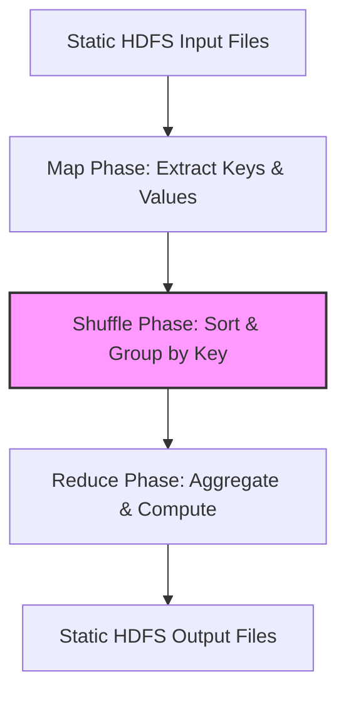

# Chapter 10: Batch Processing

## 🎯 Core Thesis
Batch processing is the offline execution of data computation over large, static, historical datasets. The primary paradigm is **MapReduce** (and its modern successors like **Apache Spark** and **Flink**), which models data processing as a pipeline of functional transformations. Unlike interactive database query systems, batch processing systems prioritize **throughput** and **fault tolerance** over low latency.

---

## 🔑 Key Terminology

*   **Batch Processing**: Processing large volumes of static, bounded data that has been collected over a period, running as an offline job.
*   **MapReduce**: A software framework developed by Google for processing massive datasets in parallel across clusters of hardware.
*   **Mapper**: The first stage of a MapReduce job. It parses input records, extracts keys and values, and partitions them.
*   **Reducer**: The second stage of a MapReduce job. It processes groups of intermediate keys and values to compute the final aggregated result.
*   **Sort and Shuffle**: The intermediate framework step between Map and Reduce that groups all values sharing the exact same key together.
*   **Skew (Straggler)**: A node that runs significantly slower than others (e.g., due to processing a partition with a high-volume key), delaying the entire batch job.
*   **Dataflow Engine (DAG)**: Modern batch processing frameworks (like Spark or Flink) that model processing as a Direct Acyclic Graph (DAG) of transformations, keeping intermediate state in memory rather than writing to disk.

---

## ⚙️ The MapReduce Workflow

MapReduce divides data processing into clean, isolated steps. Each step can fail and retry independently, making the system highly fault-tolerant.

### The Three Phases:
1.  **The Map Phase**:
    *   Input data is split into chunks, and a `Mapper` task is launched on the node containing the chunk (data locality).
    *   The mapper outputs key-value pairs.
2.  **The Shuffle & Sort Phase**:
    *   The framework takes the key-value pairs, hashes the keys to route them to specific Reducer partitions, and sorts them.
    *   *Guarantee*: All values for the key `K` are guaranteed to arrive at the same `Reducer` task.
3.  **The Reduce Phase**:
    *   The `Reducer` function is called once for each unique key, receiving an iterator over all its associated values.
    *   It computes the output (e.g., summing counts, joining records) and writes it back to a distributed filesystem (HDFS).

---

## ⚡ Dataflow Engines (Spark, Flink, Tez)

While MapReduce is robust, it is highly inefficient for complex workflows (multi-stage pipelines) because the output of every MapReduce job must be written completely to disk (HDFS) before the next job can read it. 

### Why Spark and Flink are 10x-100x Faster:
1.  **DAG Execution Model**: They model the entire pipeline as a single, unified program (a Directed Acyclic Graph). They only execute the pipeline when an action is called (lazy evaluation), optimizing the execution path globally.
2.  **Memory First (RDDs/DataFrames)**: Intermediate states are stored in-memory. Data is only written to disk if a partition exceeds RAM capacity or when writing final results.
3.  **No Rigid Map/Reduce Split**: They offer arbitrary functional operators (e.g., `filter()`, `join()`, `groupBy()`, `flatSort()`) rather than forcing everything into a strict Map-then-Reduce structure.

---

## 📋 Batch Joins Strategies

When joining two large datasets (e.g., `Users` and `Orders`) in a distributed batch job:

*   **Sort-Merge Join (Reduce-Side Join)**:
    *   *How*: Mappers extract the join key (e.g., `user_id`). The shuffle phase groups and sorts both datasets by `user_id`. The Reducer receives the user record followed by all their orders and merges them.
    *   *Pros*: Scalable to infinite data sizes.
    *   *Cons*: Heavy network and disk cost due to shuffling all data.
*   **Broadcast Hash Join (Map-Side Join)**:
    *   *How*: If one dataset is small enough to fit into memory (e.g., a lookup table of `ProductCategories`), the engine broadcasts the small table to every node running a mapper. The mapper loads the small table into a hash map and performs the join locally during the map phase.
    *   *Pros*: Zero shuffle cost; extremely fast.
    *   *Cons*: Requires one dataset to fit fully in memory.
