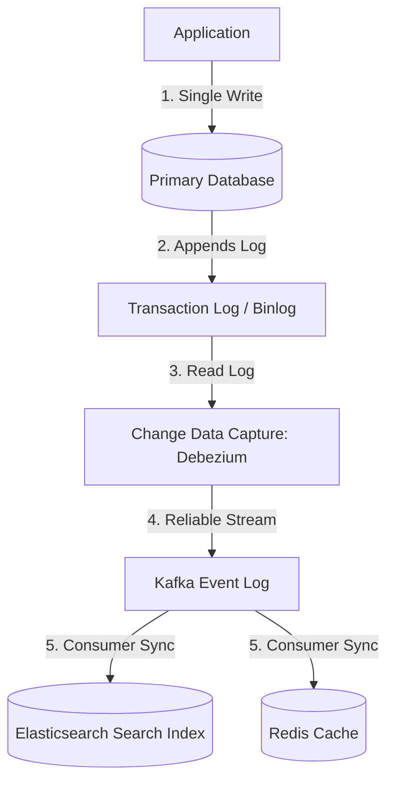

# Chapter 12: The Future of Data Systems

## 🎯 Core Thesis
There is no single "silver bullet" database or tool that can solve every data requirement. A complete, production-grade software architecture must integrate multiple specialized systems—such as relational databases, NoSQL document stores, caches, full-text search indexes, and graph databases. The future of data systems lies in **Data Integration**—building clean, reliable, and eventually consistent pipelines to synchronize state across these separate systems automatically and correctly.

---

## 🔑 Key Terminology

*   **Data Integration**: The process of coordinating state across separate specialized data systems (e.g., updating a search index when a database record is modified).
*   **Change Data Capture (CDC)**: A reliable data integration pipeline that parses a database transaction log to stream changes to other systems.
*   **Idempotency**: An operation that can be executed multiple times and yields the exact same state as if it had been run only once (crucial for surviving retries in distributed networks).
*   **Lambda Architecture**: A hybrid data processing design that runs a fast stream processing engine for real-time, low-latency updates, and a slow batch processing engine in parallel to periodically recalculate and guarantee exact, historical correctness.
*   **Kappa Architecture**: A simplified stream-first design that processes all data through a single stream engine (like Kafka + Flink). To recalculate history, the engine simply replays the raw event log from offset 0, eliminating the need for a separate batch pipeline.
*   **Unbundled Database**: An architectural design pattern where independent, specialized systems (storage, indexing, caching, stream processing) communicate via append-only logs, behaving like a single distributed database whose components have been "unbundled."

---

## 🔗 The Data Integration Challenge: Dual-Writes vs. Log-Based Sync

A major source of bugs in modern microservices is the **Dual-Write Problem**:

```text
Dual-Write Pattern (Fragile & Prone to Drift):
[User Action] ---> 1. Update Database (Success)
              ---> 2. Update Elasticsearch Index (FAIL / Network Outage)
              ====== Result: Database and Search Index are out of sync forever! ======
```

### The Clean Solution: Log-Based Sync (CDC)
Instead of forcing the application to write to multiple systems directly, the application writes *only* to the source of truth (the database). A Change Data Capture system reads the database's append-only transaction log and streams the changes to other systems reliably:



*   **Why this is robust**: Since the transaction log is the absolute order of historical events, if Elasticsearch or Redis crashes, they can simply resume consuming from their last known Kafka offset when they recover. The systems are guaranteed to achieve **Eventual Consistency** without race conditions.

---

## ⚖️ Ensuring Correctness: End-to-End Reliability

Even with transactional databases, systems can experience silent corruption, duplicated network requests, or out-of-order execution. 

### 1. Idempotency (Surviving Retries)
In an unreliable network, duplicate messages are inevitable. If a client sends a payment request and the network drops before receiving the response, the client will retry the payment.
*   *Mitigation*: The client must attach a unique **Idempotency Key** (UUID) to the request. The server registers the key in a database transaction; if a duplicate key arrives, the server simply returns the cached response without executing the payment a second time.

### 2. End-to-End Arguments
Relying strictly on low-level database transactions is not enough. If an error occurs in the application layer (e.g., a bug in the code that calculates sales tax), the database will commit the transaction successfully, but the data is incorrect.

> [!TIP]
> **End-to-End Correctness**: True reliability requires high-level application auditing. For example, in double-entry bookkeeping, the system runs periodic batch audit jobs to verify that the sum of all debits equals the sum of all credits. If they do not align, an alert is raised to resolve the bug, regardless of individual database transaction success.

---

## 🚀 The Unbundled Database
The ultimate architectural trend is the **Unbundled Database**. Rather than trying to build a monolithic database that does everything (which inevitably fails at scale), we coordinate specialized components:

*   **Write Path**: Handled by an immutable, append-only distributed event log (Kafka).
*   **Read Path**: Handled by specialized read-only views (indexes, caches, relational shards, graph models) that build their local state asynchronously from the event log.

This separation allows developers to scale writes and reads independently, swap out technologies cleanly, and build highly performant, resilient systems.
