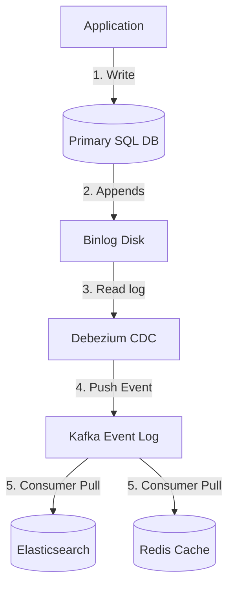
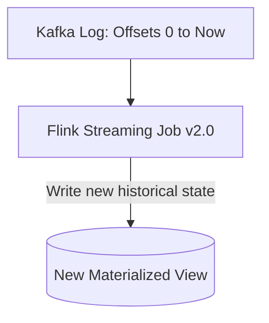

# Chapter 12: The Future of Data Systems (Interview-Grade Deep Dive)

## 🎯 Core Thesis
No single database engine can satisfy all functional requirements (storage, search, caching, analytical reporting) of a large-scale system. Modern software architecture must integrate specialized tools. The future of data engineering lies in **Data Integration**—specifically, treating the entire system as an **Unbundled Database**. Under this paradigm, specialized datastores are modeled as indexes or materialized views derived asynchronously and reliably from a central, immutable, append-only event log (like **Kafka**).

---

## 🔑 Key Terminology & Academic Definitions

*   **Change Data Capture (CDC)**: A highly reliable data integration technique that extracts database updates directly from the transaction log (WAL), converting them into an event stream.
*   **Dual-Write**: An anti-pattern where an application writes directly to two separate systems (e.g., updating a database and an Elasticsearch index) without a coordinating transaction.
*   **Lambda Architecture**: A hybrid architecture that processes real-time data using a stream engine (low latency but eventually consistent) and processes historical data in parallel using a batch engine (high latency but highly accurate), merging the results at read time.
*   **Kappa Architecture**: A unified stream-first architecture where all data processing (real-time and historical) goes through a single streaming engine, with historical recalculations handled by replaying the event log from offset 0.
*   **Unbundled Database**: An architectural pattern that decouples the components of a database (storage, search indexes, caches, materialized views) and coordinates them using an append-only event log.
*   **Idempotency Key**: A unique UUID attached to a request by the client, ensuring the database can detect duplicate requests and prevent double-execution during network retries.

---

## 🛡️ Data Integration: Solving the Dual-Write Problem

In system design interviews, a common requirement is to keep a cache (Redis) or full-text search index (Elasticsearch) in sync with your primary SQL database.

> [!CAUTION]
> **The Dual-Write Outage**:
> * A naive developer writes application code that updates the SQL database and then immediately sends an update to Elasticsearch.
> * If the database write succeeds but the network drops before the Elasticsearch write succeeds, the search index is **out of sync forever**.
> * Race conditions also occur: if two users update the same record at the same time, network delays can cause Node A to receive writes in order `1 -> 2`, while Node B receives them in order `2 -> 1`, causing permanent data drift.

```text
Dual-Write Drift (Naive Approach):
[Client Request] ---> Writes "Alice" to SQL Database (Success)
                 ---> Writes "Alice" to Elasticsearch Index (FAIL / Network Drop!)
                 ====== Database = "Alice", Elasticsearch = "Bob" (Permanent Drift) ======
```

### The Production Solution: Log-Based Sync (CDC)
Change Data Capture (using tools like **Debezium**) reads the database's append-only transaction log (binary log/binlog) directly. It converts updates into a Kafka event stream, which consumers read to update Redis and Elasticsearch.



*   *Why this is bulletproof*: The transaction log is the absolute chronological order of truth. If Elasticsearch crashes, it can simply recover, read its last processed Kafka offset, and catch up, guaranteeing **Eventual Consistency** without race conditions.

---

## ⚡ Batch/Stream Convergence: Lambda vs. Kappa

When designing large-scale analytical architectures, you must compare Lambda and Kappa:

### 1. The Lambda Architecture (The Legacy Model)
*   *Concept*: Runs two separate systems. 
    1. A **Speed Layer** (e.g., Storm/Flink) processes incoming real-time streams to provide low-latency but potentially inaccurate/eventually consistent updates.
    2. A **Batch Layer** (e.g., Hadoop/Spark) processes historical data in parallel to calculate exact, physically correct values.
    3. The **Serving Layer** queries both and merges the results.
*   *Why it is hated*: High operational complexity. Developers must write and maintain the exact same business logic **twice**—once in Java/Scala for the batch engine, and once in a streaming framework for the speed engine.

---

### 2. The Kappa Architecture (The Modern Standard)
*   *Concept*: Stream-first. All data flows through a single streaming engine (e.g., Flink) that handles both real-time and historical processing.
*   *How historical recalculation works*:
    If you change your business logic, you don't boot up a separate batch system. Instead:
    1. You deploy a new version of your streaming job.
    2. You reset the consumer offset to **offset 0** of the Kafka event log (which retains history).
    3. The streaming job replays history at maximum speed, writing the new results to a new database view.
    4. You switch the client read pointer to the new view and deprecate the old one.



---

## 🏆 System Design Interview Playbook: End-to-End Correctness

When concluding a system design interview, demonstrate senior-level engineering maturity by addressing **End-to-End Correctness**:

1.  **Idempotence (Surviving Retries)**:
    *   In an unreliable network, duplicate messages are guaranteed to occur due to client retries.
    *   *Design*: Attach a unique **Idempotency Key** (UUID) to every transaction. The database registers this key in a unique constraint. If a duplicate key arrives, the database rejects the write and simply returns the cached response of the first transaction, preventing double-billing or duplicate records.
2.  **Application-Level Auditing**:
    *   Database transactions only guarantee that data is written successfully; they cannot detect bugs in application logic (e.g., a rounding error in currency calculations).
    *   *Design*: Implement high-level, independent audit jobs. In banking, this is a batch job that verifies that the sum of all debits equals the sum of all credits at the end of the day, raising alerts if a discrepancy is found. This is the **ultimate safety net** of data intensive applications.
