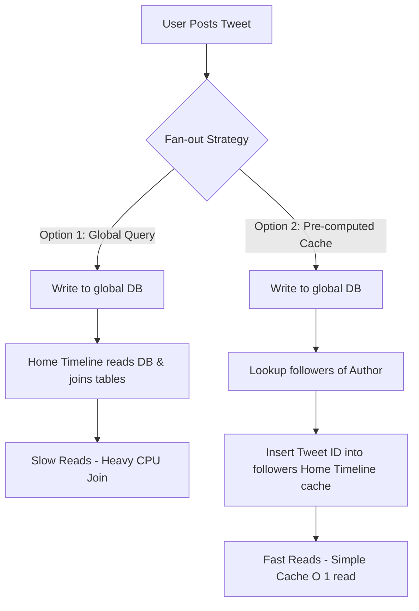

# Chapter 1: Reliable, Scalable, and Maintainable Applications

## 🎯 Core Thesis
Software systems must balance three fundamental requirements: **Reliability** (working correctly even when things go wrong), **Scalability** (handling growth in load without degrading performance), and **Maintainability** (remaining easy for new engineers to understand and modify over time).

---

## 🔑 Key Terminology

*   **Fault**: A single component of the system deviating from its spec. Faults are inevitable; the goal is to build fault-tolerant systems.
*   **Failure**: The complete system failing to provide the required service to the user. A sequence of faults can lead to failure.
*   **Scale Parameter**: A metric used to describe system load (e.g., requests per second, write/read ratio, active users, cache hit rate).
*   **Percentiles ($p50, p95, p99, p99.9$)**: Metrics for response time. $p99.9$ represents the "tail latency" (the slowest 1 in 1000 requests), which often impacts the most valuable, high-spending users.
*   **SLA (Service Level Agreement)**: A formal contract defining expected performance and availability (e.g., $99.9\%$ of requests must have latency under 200ms).

---

## 🛠️ Deep Dive: The Three Pillars

### 1. Reliability (Fault Tolerance)
A reliable system continues to perform its user functions correctly even in the face of adversity (faults). We classify faults into:

*   **Hardware Faults**: Hard drives crash, RAM corrupts, power grids fail.
    *   *Mitigation*: Redundancy (RAID arrays, dual power supplies, multi-datacenter failovers).
*   **Software Errors**: Bugs, runaway processes, memory leaks, broken third-party dependencies.
    *   *Mitigation*: Extensive testing, sandboxing, monitoring, automated process recovery, and graceful degradation.
*   **Human Errors**: Misconfigurations (the leading cause of outages).
    *   *Mitigation*: Restrict permissions, provide sandbox testing environments, automate deployment, and set up fast rollback mechanisms.

---

### 2. Scalability (Handling Load)
Scalability is the ability of a system to cope with increased load. To reason about scale, we must define **Load Parameters** and **Performance Metrics**.

#### Case Study: Twitter's Architecture Shift
Twitter's core scaling challenge is not raw volume, but fan-out (users following many users, and users having many followers).

*   **Hybrid Solution**: Twitter shifted to a hybrid model. Users with standard follower counts (e.g., < 10,000) use the pre-computed cache model (Option 2). High-profile celebrities (e.g., millions of followers) are excluded from the pre-computation pipeline; their tweets are joined dynamically at read time (Option 1) to prevent write-amplification bottlenecks.

#### Describing Performance (Percentiles vs. Averages)
Never use **Average Latency** to measure scalability. Averages obscure outliers. Instead, use **Percentiles**:

> [!TIP]
> **Tail Latency ($p99.9$)** is crucial because the users who experience it are often those with the largest datasets (e.g., massive shopping carts on Amazon), meaning your most profitable customers are the ones facing the slowest load times.

---

### 3. Maintainability (Reducing Cost)
Three core principles make a system maintainable:

1.  **Operability**: Make it easy for operations teams to keep the system running smoothly.
2.  **Simplicity (Managing Complexity)**: Keep the system understandable by avoiding "accidental complexity." This is achieved through clean **abstractions** (e.g., SQL abstracting away raw disk operations).
3.  **Evolvability (Extensibility)**: Make it easy for developers to adapt the system to new requirements (also known as agility).

---

## 📋 System Design Cheat Sheet: Scalability Trade-Offs

When scaling a system, choose between:

*   **Scaling Up (Vertical Scaling)**: Moving to more powerful machines (e.g., more RAM, CPU cores).
    *   *Pros*: Simple, no network synchronization issues.
    *   *Cons*: Hardware limit bottlenecks, expensive, single point of failure.
*   **Scaling Out (Horizontal Scaling)**: Distributing load across multiple smaller machines.
    *   *Pros*: Virtually infinite scale, highly resilient.
    *   *Cons*: Introduces complex distributed systems challenges (clocks, network latency, consistency).
