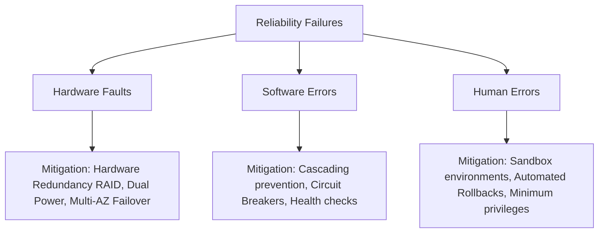

# Chapter 1: Reliable, Scalable, and Maintainable Applications (Interview-Grade Deep Dive)

## 🎯 Core Thesis
Every system design interview begins here: defining the fundamental characteristics of a high-performance system. The goal of database and system architecture is not merely writing code that runs, but managing three architectural dimensions: **Reliability** (resisting faults), **Scalability** (coping with increased load), and **Maintainability** (mitigating operational complexity).

---

## 🔑 Key Terminology & Academic Definitions

*   **Fault**: A single component of the system deviating from its expected specification. Faults are unavoidable.
*   **Failure**: When the entire system stops providing the required service to the end user. A cascading sequence of unhandled faults triggers a failure.
*   **Load Parameter**: A measurable quantitative metric defining the load on a system (e.g., QPS, read-to-write ratio, concurrent active connections, database size, cache hit rate).
*   **Tail Latency ($p99, p99.9$)**: The response time metric representing the slowest $1\%$ or $0.1\%$ of user requests. This tail represents the worst user experiences.
*   **SLA (Service Level Agreement)**: A formal legal or business contract defining expected performance metrics (e.g., "the system must guarantee $99.9\%$ uptime and $p95$ latency $\le 200$ms").
*   **Head-of-Line Blocking**: A performance bottleneck where a slow request at the head of a queue blocks all subsequent requests behind it.

---

## 🛡️ Pillar 1: Reliability (Building Fault-Tolerant Systems)

In interviews, when asked how you ensure a system is highly available and reliable, categorize your answers into three mitigation domains:



### 1. Hardware Faults
*   *Anatomy*: Hard drives crash (MTBF of disks is ~3-5 years), RAM corrupts, network switches disconnect.
*   *Design Mitigations*:
    *   RAID storage arrays.
    *   Dual power supplies and hot-swappable CPUs.
    *   **Multi-Availability Zone (Multi-AZ) / Multi-Region deployments** to survive entire datacenter power grid outages.

### 2. Software Errors (Cascading Faults)
*   *Anatomy*: Unlike independent hardware faults, software errors trigger **cascading failures** across nodes (e.g., a memory leak causing one node to crash, which increases load on remaining nodes, causing them to crash in a domino effect).
*   *Design Mitigations*:
    *   **Circuit Breakers**: Stop sending requests to a degraded dependency to let it recover.
    *   **Health Checks & Watchdogs**: Automatically kill and restart unresponsive server processes.
    *   **Resource Isolation (Bulkheads)**: Partition resources (CPU/threads) so a single bad tenant cannot exhaust resources for other tenants.

### 3. Human Errors
*   *Anatomy*: Misconfigurations (the leading cause of high-impact production outages).
*   *Design Mitigations*:
    *   Provide safe sandbox environments to test configurations.
    *   Automate deployment scripts and enable **Instant rollback mechanisms**.
    *   Implement strict monitoring and telemetry (the "observability" baseline).

---

## 📈 Pillar 2: Scalability (Describing and Handling Load)

### 1. Case Study: Twitter's Fan-Out Architecture
This is a classic interview question evaluating write-amplification vs. read-amplification.

*   **Load Parameters**:
    *   **Write Volume**: ~4,600 tweets/sec average, ~12,000 tweets/sec peak.
    *   **Read Volume**: ~300,000 timeline fetches/sec.
    *   **Key Challenge**: The **fan-out ratio**—each user has many followers, and follows many users.

#### Strategy A: Read-Path Pull Model (Standard SQL Join)
*   *Flow*: When User A posts a tweet, it is written to the global `tweets` table. When User B fetches their home timeline, the database joins `followers`, `tweets`, and `users` to compute the timeline dynamically.
*   *Bottleneck*: Extreme read latency. Querying `300,000` complex database joins per second is computationally unsustainable.

#### Strategy B: Write-Path Push Model (Pre-computed Cache)
*   *Flow*: When User A posts a tweet, the system queries User A's followers. It inserts the tweet ID directly into the in-memory **Home Timeline cache** (Redis list) of *every single follower*.
*   *Advantage*: Home timeline reads are $O(1)$ fast memory lookups.
*   *Bottleneck (The Celebrity Problem)*: If a celebrity with 50 million followers tweets, the system must perform **50 million cache updates** in real-time. This write-amplification storm delays delivery and degrades database queues.

#### Strategy C: The Modern Hybrid Model (Production Solution)
*   Standard users (followers < 10,000) are processed via **Strategy B (Pre-computed Cache)**.
*   Celebrities (followers > 10,000) are excluded from the pre-computation pipeline.
*   When a standard user reads their timeline, the system retrieves their pre-computed Redis cache and **dynamically merges** it with the live tweets of any celebrities they follow. This keeps reads fast and eliminates the write-amplification storm.

---

### 2. Response Time Percentiles: The Anatomy of Latency

```text
Percentile Hierarchy:
p50 (Median)   ---> 50% of requests are faster than this. The standard user experience.
p95            ---> 95% of requests are faster than this.
p99            ---> 99% of requests are faster than this.
p99.9 (Tail)   ---> 99.9% of requests are faster than this. The slowest 1 in 1000 requests.
```

#### Why Tail Latency ($p99.9$) Matters:
1.  **High-Value Users**: Users with the largest datasets (e.g., those with thousands of items in their Amazon shopping carts or complex profiles) trigger the most database joins. These are your most profitable customers, yet they are the ones hit by tail latency.
2.  **Microservice Fan-out Amplification**: If a single page load requires calls to 100 internal microservices in parallel, the total page response time is dictated by the **slowest microservice**. Even if each service has a $99\%$ success rate, the probability that the overall request faces tail latency is extremely high.

```text
Fan-Out Probability Formula:
P(All successful under p99) = 0.99^100 ≈ 36.6%
This means 63.4% of your overall page loads will face tail latency!
```

---

## 🏛️ Pillar 3: Maintainability (Operability, Simplicity, Evolvability)

1.  **Operability**: Making it easy for operations teams to keep the system running (monitors, runtime configs, rollback agility).
2.  **Simplicity**: Eliminating **accidental complexity**. Keep code readable and design unified. The primary tool for simplicity is **clean abstractions** (e.g., SQL abstracting CPU/disk, TCP abstracting packet loss).
3.  **Evolvability**: The ease of making changes. Decouple system architectures so that components can be refactored without breaking downstream users.

---

## 🏆 System Design Interview Playbook: The Scaling Framework

Use this framework at the start of any system design interview to establish your load requirements:

1.  **Establish QPS Requirements**:
    *   Read QPS vs. Write QPS (determine if the system is **Read-Heavy** or **Write-Heavy**).
    *   *Why*: Read-heavy systems require heavy caching and read replicas. Write-heavy systems require LSM-Trees, sharding, and message queues.
2.  **Estimate Storage Capacity**:
    *   `Average payload size * Daily writes * 365 days * Replication factor (usually 3)`.
    *   *Why*: Determines if you can fit data on a single node or if you must design partition/sharding strategies.
3.  **Define Latency SLAs**:
    *   What is the target $p99$ response time?
    *   *Why*: Strict low-latency SLAs require memory-first caching, CDN edge distribution, and request hedging.
