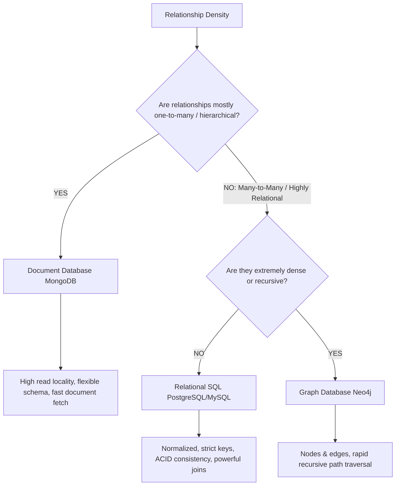

# Chapter 2: Data Models and Query Languages (Interview-Grade Deep Dive)

## 🎯 Core Thesis
Data models dictate how we model reality in software. Choosing the wrong data model forces developers to write complex, fragile translation layers in application code. To design scalable systems, you must understand that there is no "one-size-fits-all" database model; instead, you must select the model whose data relationships (hierarchical, tabular, or highly interconnected) match your application's natural access patterns.

---

## 🔑 Key Terminology & Academic Definitions

*   **Impedance Mismatch**: The architectural disconnect between the object-oriented memory model used in application code (objects with nested, rich tree structures) and the tabular relational model used by SQL databases (flat tables with strict foreign keys).
*   **Normalization**: The process of organizing a relational database to minimize data redundancy by storing references to singular master records.
*   **Denormalization**: The process of duplicating data in multiple places to speed up reads, trading write speed and consistency for instant read performance.
*   **Schema-on-Write (SQL)**: Strict schema enforcement where the database verifies the data matches the table definition before allowing the write.
*   **Schema-on-Read (NoSQL)**: A flexible design where the database accepts raw binary/JSON bytes without verification, leaving the application code to interpret and parse the structure when reading.
*   **Declarative Query Language**: A language (like SQL) where the developer specifies the *intent* ("what data I want"), allowing the database engine's optimizer to construct the optimal physical execution plan.
*   **Imperative Query Language**: A language or programming model where the developer writes the exact step-by-step loops and pointer-traversal instructions to retrieve data.

---

## ⚔️ Data Model Selection: SQL vs. Document NoSQL

In a system design interview, selecting between SQL and NoSQL requires a structured evaluation of your relationships and data access patterns:



---

## 🛡️ Deep Dive: The Data Models

### 1. The Tabular Relational Model (SQL)
*   **Core Mechanics**: Data is normalized into flat tables. Relationships are represented as foreign keys.
*   **The Impedance Mismatch in Practice**:
    An object-oriented user profile (e.g., `User` object with a list of `Job` objects and `Education` objects) must be shredded into multiple database tables (`users`, `jobs`, `education`) linked by `user_id`. When reading this data, the database must join these tables, which requires random disk I/O and heavy CPU processing.
*   **Normalization Trade-off**:
    *   *Pros*: Updates are extremely clean and $O(1)$. If an organization changes its name, you update a single row in the `organizations` table, and all users referencing that organization instantly see the new name.
    *   *Cons*: Reads are expensive because they require multi-table joins.

### 2. The Hierarchical Document Model (NoSQL)
*   **Core Mechanics**: Data is stored as self-contained JSON/BSON documents. Relationships are nested directly inside the document.
*   **Storage Locality**: 
    Because the entire user profile (including nested jobs and education) is serialized into a single contiguous block of bytes on disk, the database can fetch the entire record in a **single disk seek**. This provides phenomenal read performance.
*   **Denormalization Trade-off**:
    *   *Pros*: Unbelievably fast reads; no joins required.
    *   *Cons*: Updates are extremely expensive. If you duplicate the organization's name inside every user's document, changing the organization's name requires running a massive, cluster-wide update query to scan and rewrite millions of documents, creating data drift risks.

---

## ⚙️ Declarative vs. Imperative Querying

In an interview, you may be asked to compare SQL with imperative models (like map-reduce or standard application loops):

```text
Imperative Model (Programmer-controlled loops):
1. Initialize an empty list: result = []
2. For each user in users:
3.     If user.country == 'USA':
4.         For each purchase in user.purchases:
5.             If purchase.amount > 100:
6.                 result.append(purchase)
```
*Why this is fragile*: The programmer dictates the exact traversal path. If the database index changes, this code cannot adapt.

```sql
-- Declarative Model (SQL):
SELECT p.* FROM users u
JOIN purchases p ON u.id = p.user_id
WHERE u.country = 'USA' AND p.amount > 100;
```
*Why this is superior*: The database engine's **Query Optimizer** evaluates database statistics (e.g., how many users live in the USA, what indexes are available) and decides whether to perform an index scan, a hash join, or a sequential scan. The query engine can be upgraded and optimized under the hood, and the SQL code automatically runs faster **without changing a single line of application code**.

---

## 🕸️ The Graph Database Model
Graph databases (like Neo4j) are the ultimate solution when many-to-many relationships become deeply nested, recursive, or infinitely varied.

### Property Graph Model (Nodes and Edges)
*   **Nodes (Vertices)**: Represent entities (e.g., User, City, Product).
*   **Edges (Relationships)**: Represent links between entities. Edges are first-class citizens, meaning they can have their own properties (e.g., `since: "2026"`, `weight: 0.9`).

#### The Power of Cypher
To find a chain of recommendations (e.g., "Find friends of friends who bought the same product"):

```cypher
MATCH (u:User {name: "Alice"})-[:FRIEND*1..2]-(f:User)-[:BOUGHT]->(p:Product)<-[:BOUGHT]-(u)
RETURN p.name, f.name
```
*Why it excels*: In SQL, a recursive join of arbitrary depth (friends of friends of friends) requires complex **Recursive Common Table Expressions (CTEs)** that are hard to read and execute extremely slowly due to multiple nested loops. Graph databases traverse pointers directly on disk/memory in $O(1)$ time per hop.

---

## 🏆 System Design Interview Playbook: Selecting the Database

When selecting a database model in a system design interview, use these concrete architectural justifications:

```text
Database Selection Guide:
─────────────────────────────────────────────────────────────────────────────
Is the data highly structured, uniform, and heavily reliant on strict integrity?
 └── YES ──> Choose RELATIONAL SQL (PostgreSQL).
             Justification: ACID guarantees, robust query optimizer, native 
             join optimizations, schema enforcement at write-time.

Is the data unstructured, highly dynamic, or tree-like (nested documents)?
 └── YES ──> Choose DOCUMENT NoSQL (MongoDB).
             Justification: Storage locality (fast O(1) document reads), 
             schema-on-read flexibility, easy horizontal sharding.

Are you building a recommendation engine, social graph, or fraud detection system?
 └── YES ──> Choose GRAPH DATABASE (Neo4j).
             Justification: Pointers are stored directly as relationships, 
             eliminating join tables; Cypher handles recursive traversals natively.
─────────────────────────────────────────────────────────────────────────────
```
