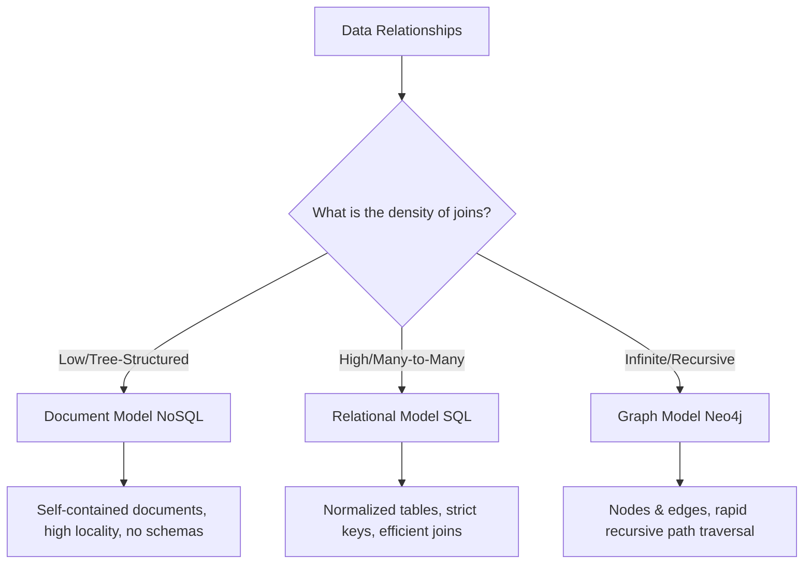

# Chapter 2: Data Models and Query Languages

## 🎯 Core Thesis
Data models are the most important part of software development because they dictate not only how we write code, but how we **think** about the problem we are solving. Different models are optimized for different relationships: **Relational** is best for structured, uniform data; **Document** is best for self-contained, hierarchical data; and **Graph** is best for highly interconnected datasets.

---

## 🔑 Key Terminology

*   **Impedance Mismatch**: The disconnect between the object-oriented model used in application code (objects, classes, nested items) and the tabular relational model of tables, rows, and columns.
*   **One-to-Many Relationship**: A parent entity linked to multiple child entities (e.g., a user having multiple job experiences).
*   **Many-to-Many Relationship**: Multiple entities on both sides linked to each other (e.g., users linked to multiple organizations, and organizations containing multiple users).
*   **Declarative Query**: Specifying *what* data you want, leaving the database optimizer to decide *how* to fetch it (e.g., SQL).
*   **Imperative Query**: Specifying the exact step-by-step instructions and loops to retrieve data (e.g., IMS, CODASYL, or procedural code).
*   **Schema-on-Write**: Traditional SQL databases. The schema is enforced strictly when data is written.
*   **Schema-on-Read**: Document NoSQL databases. The structure is flexible; data is parsed dynamically when read.

---

## ⚔️ Deep Dive: SQL vs. Document NoSQL



### 1. Document Model (NoSQL)
*   **Best For**: Tree-structured data where documents are mostly self-contained and relationships are hierarchical.
*   **Key Advantage: Schema Flexibility & Locality**:
    *   Since all data (e.g., a user's resume, work history, education) is stored in a single JSON document, the database can fetch the entire record in a single disk seek.
*   **Key Disadvantage: Poor Joins**:
    *   Representing many-to-many relationships requires storing document references. Performing joins must be handled manually in application code (multiple round-trips) or via slow database aggregations.

### 2. Relational Model (SQL)
*   **Best For**: Highly structured data with many-to-many relationships and complex joins.
*   **Key Advantage: Normalization & Integrity**:
    *   Eliminates duplicate data by storing references to normalized master tables (e.g., storing a `region_id` pointing to a `regions` table rather than spelling out the region name in every user row). This prevents data drift.
*   **Key Disadvantage: Impedance Mismatch**:
    *   Requires mapping code (ORMs like Hibernate or Prisma) to translate table joins back into object instances.

---

## 📊 Comparison Matrix

| Feature | Relational (SQL) | Document (NoSQL) |
| :--- | :--- | :--- |
| **Schema enforcement** | **Schema-on-Write** (Strict) | **Schema-on-Read** (Flexible) |
| **Storage Locality** | Low (Spread across joined tables) | High (Contiguous document block) |
| **Many-to-Many Joins** | Highly optimized natively | Poor (Must be resolved in application code) |
| **Normalization** | High (Avoids redundancy) | Low (Data is duplicated for speed) |
| **Query Language** | Declarative (SQL) | Imperative/MapReduce or custom APIs |

---

## 🕸️ The Graph Model
When many-to-many relationships become extremely dense, complex, and deeply nested, relational tables become unusable due to query complexity and massive join degradation. Graph databases model data as **Nodes** (vertices) and **Edges** (relationships).

### Typical Use Cases
*   Social networks (followers, friendships)
*   Fraud detection (tracking shared credit cards, IP addresses, bank accounts)
*   Knowledge graphs (interlinked semantic concepts)

### Cypher (Declarative Graph Query Example)
Finding all people who live in the same city as Alice:
```cypher
MATCH (alice:Person {name: "Alice"})-[:LIVES_IN]->(city:City)<-[:LIVES_IN]-(other:Person)
RETURN other.name
```
*Why it is elegant*: To do this in SQL requires joining three tables (`people`, `cities`, `locations`) twice. In Cypher, it is represented as a clean, visual ascii-art match pattern.
