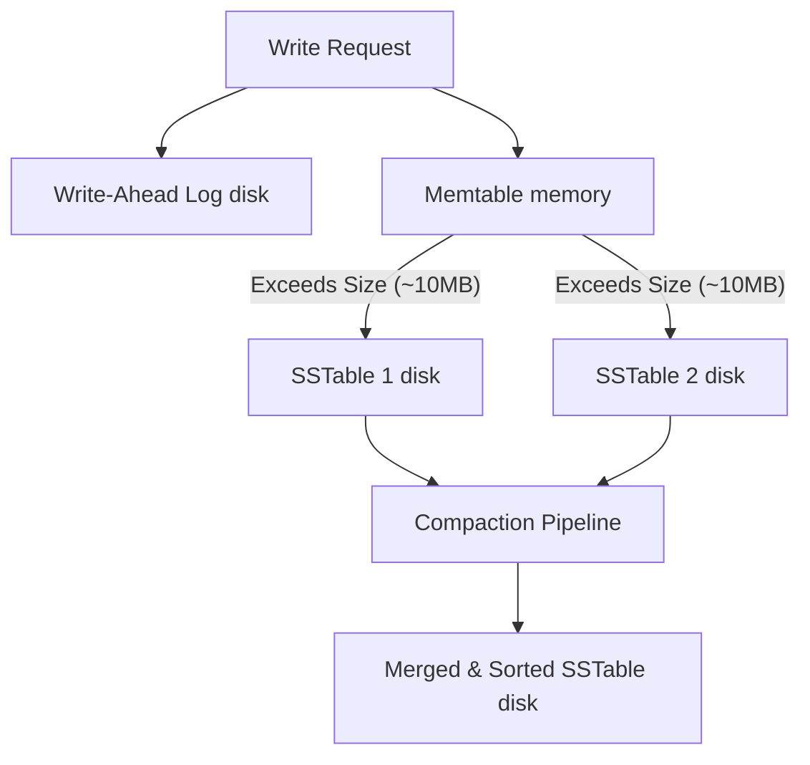
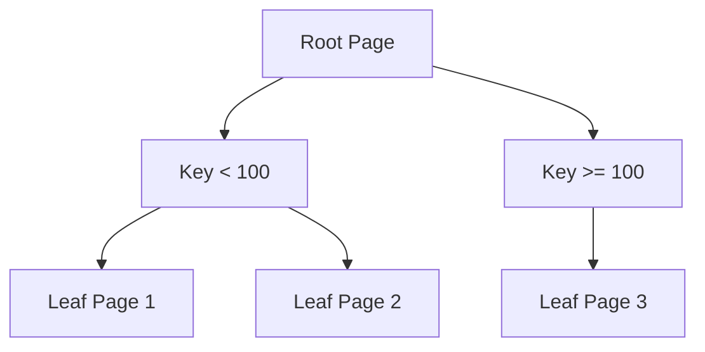

# Chapter 3: Storage and Retrieval

## 🎯 Core Thesis
There is a fundamental trade-off in storage engine design: **Log-Structured Merge-Trees (LSM-Trees)** optimize for high-speed, sequential writes at the expense of slower reads, whereas **B-Trees** optimize for high-speed, random reads at the expense of slower, random writes.

---

## 🔑 Key Terminology

*   **LSM-Tree (Log-Structured Merge-Tree)**: A write-optimized storage engine that appends data sequentially to a log file, periodically merging and sorting it.
*   **B-Tree**: A read-optimized, balanced tree storage engine that updates pages in-place on disk. It is the default for most relational databases.
*   **Write-Ahead Log (WAL)**: An append-only log file on disk where database operations are written before modifying the database tree. This guarantees durability if the database crashes.
*   **SSTable (Sorted String Table)**: An immutable file format used in LSM-Trees that stores key-value pairs sorted by key.
*   **Memtable**: An in-memory, sorted write buffer (often implemented as a Red-Black Tree or Skip List) where active writes are buffered before being flushed to SSTables.
*   **Compaction**: The background process of merging multiple SSTables, resolving duplicate keys, and discarding deleted records to reclaim disk space.
*   **Bloom Filter**: A space-efficient probabilistic data structure used to check if a key exists in an SSTable without performing expensive disk reads.
*   **OLTP (Online Transaction Processing)**: Database engines optimized for high-volume, low-latency, user-facing reads and writes (e.g., shopping carts).
*   **OLAP (Online Analytical Processing)**: Database engines optimized for scanning millions of rows to compute aggregations (e.g., reporting, business intelligence).

---

## 🌲 LSM-Trees vs. B-Trees

### 1. LSM-Tree Writing Mechanism (Append-Only)
Writes in an LSM-tree never overwrite files in-place. Instead:
1. Every write is appended to the **Write-Ahead Log (WAL)** on disk (for durability).
2. The write is simultaneously inserted into the in-memory **Memtable** (Skip List).
3. When the Memtable exceeds a size limit (usually ~10MB), it is flushed to disk as an immutable **SSTable**.
4. Background threads run **Compaction** to merge SSTables:



*   **Read Path**: To read a key, the database searches:
    1. The in-memory **Memtable**.
    2. The most recent **SSTables** using **Bloom Filters** to quickly skip tables that do not contain the key.

---

### 2. B-Trees (In-place Updates)
B-Trees break the database down into fixed-size **pages** (usually 4KB or 8KB) and update these pages directly on disk:
*   To update a record, the engine finds the page containing the key, modifies it in memory, and writes it back to disk (in-place update).
*   If a page has no space for a new key, it splits into two half-empty pages.



---

### 3. Comparison of LSM-Trees vs B-Trees

| Dimension | LSM-Trees (e.g., RocksDB, Cassandra) | B-Trees (e.g., InnoDB MySQL, Postgres) |
| :--- | :--- | :--- |
| **Write Throughput** | **Extremely High** (Sequential appends) | **Moderate** (Random writes, page splits, WAL writes) |
| **Read Latency** | **Slow** (Must search multiple tables) | **Extremely Fast** (Single tree index traversal) |
| **Space Overhead** | High (Duplicate keys exist during compaction) | Low (No duplicates, but has page fragmentation) |
| **Write Amplification**| Low-to-moderate | High (Every tiny change rewrites an entire page) |

---

## 📊 OLTP vs. OLAP (Row-oriented vs. Column-oriented)

### Row-Oriented Storage (OLTP)
In traditional OLTP databases, rows are stored contiguously on disk.
*   *Best for*: `SELECT * FROM users WHERE id = 123` (fetches the whole user record in one go).
*   *Worst for*: `SELECT AVG(age) FROM users` (forces the engine to read the entire table from disk, loading columns like name, email, and description into memory just to discard them).

### Column-Oriented Storage (OLAP)
OLAP data warehouses (e.g., Snowflake, BigQuery, ClickHouse) store each column in its own separate file on disk.

```text
Row-Oriented Layout (Contiguous rows):
[User1, Age30, Email1], [User2, Age25, Email2], [User3, Age40, Email3]

Column-Oriented Layout (Contiguous columns):
File 1: [User1, User2, User3]
File 2: [Age30, Age25, Age40]
File 3: [Email1, Email2, Email3]
```

#### Advantages of Columnar Storage
1.  **I/O Savings**: To calculate `AVG(age)`, the engine only reads the small file containing `File 2: Ages`. It skips all other columns, reducing disk reads by $90\%+$.
2.  **Compression**: Since all values in a column file share the same data type, they can be compressed extremely efficiently using **Run-Length Encoding (RLE)** or dictionary encoding.
