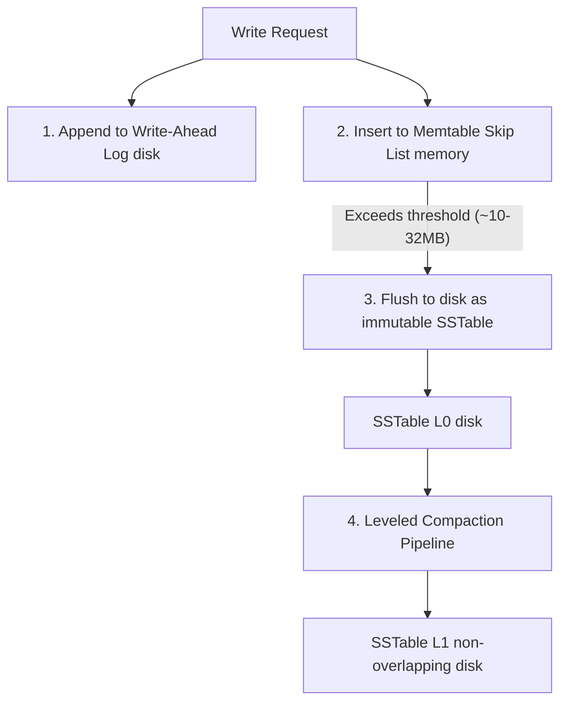
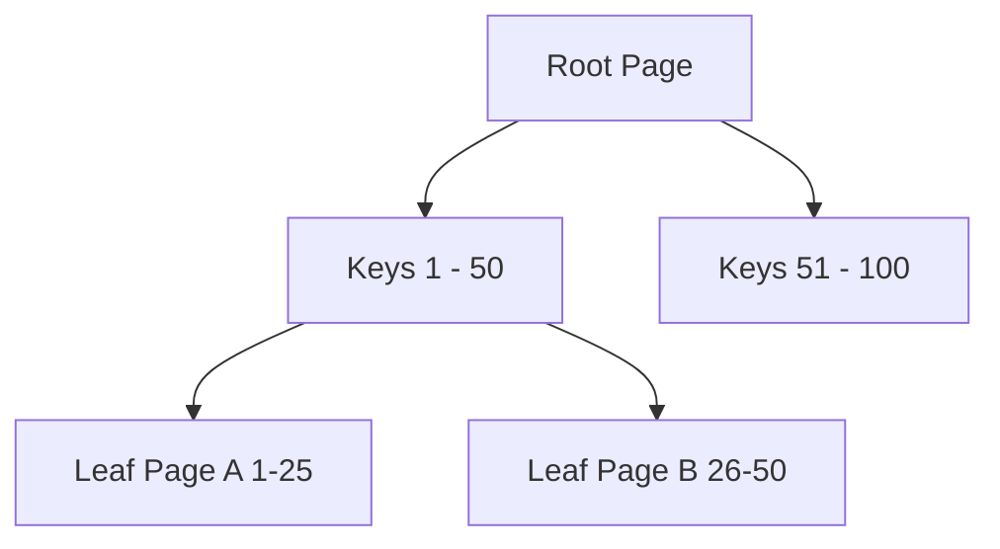

# Chapter 3: Storage and Retrieval (Interview-Grade Deep Dive)

## 🎯 Core Thesis
At the lowest level, a database must resolve a fundamental hardware trade-off: **Sequential I/O is multiple orders of magnitude faster than Random I/O** (on both mechanical HDDs and solid-state SSDs). Storage engines exploit this physical reality. **LSM-Trees** convert all writes into sequential append-only disk updates (optimizing for high-speed writes at the cost of complex reads and background compaction). **B-Trees** modify physical blocks in-place (optimizing for rapid, predictable reads at the cost of slow, random writes).

---

## 🔑 Key Terminology & Academic Definitions

*   **SSTable (Sorted String Table)**: An immutable on-disk storage file where key-value pairs are stored sequentially, sorted by key.
*   **Memtable**: An in-memory write buffer (typically a Skip List or Red-Black Tree) that maintains active writes in sorted order before flushing them to disk.
*   **Write-Ahead Log (WAL)**: An append-only log file written to disk before any in-memory state is updated, guaranteeing data durability across server crashes.
*   **Bloom Filter**: A space-efficient probabilistic data structure used to verify if a key is *definitely not* in an SSTable, preventing unnecessary disk reads.
*   **Write Amplification**: The ratio of the amount of data written to physical storage compared to the amount of data requested by the application.
*   **Leveled Compaction**: A compaction strategy that partitions SSTables into levels ($L_1, L_2$, etc.), where each level has a strict maximum size and contains non-overlapping keys.
*   **Column-Oriented Storage**: A storage model where values of the same column across all rows are stored contiguously on disk, optimizing analytical aggregation throughput.

---

## 🌲 LSM-Trees vs. B-Trees

### 1. Log-Structured Merge-Trees (LSM-Trees)
LSM-Trees (used in **Cassandra**, **RocksDB**, and **Bigtable**) are designed to bypass random disk write bottlenecks by making all writes sequential.



#### The Write Path (Sequential and Fast)
1.  **Append to WAL**: The write is appended sequentially to the Write-Ahead Log (disk seek is instantaneous).
2.  **Insert to Memtable**: The key-value pair is inserted into the in-memory **Memtable** (a Skip List that keeps keys sorted). The client receives a success response.
3.  **SSTable Flush**: When the Memtable grows to a size limit, it is flushed to disk as an immutable **Sorted String Table (SSTable)**. Because keys are already sorted in the Memtable, the flush is a pure sequential write.

#### The Read Path (The Cost of LSM-Trees)
To find a key, the database must query:
1.  The in-memory **Memtable**.
2.  The most recent SSTable files on disk, searching from newest to oldest.

*   *Optimization*: If the key does not exist, the engine would normally have to scan every SSTable on disk. To prevent this, LSM-Trees maintain a **Bloom Filter** in memory for each SSTable. The filter checks the key: if it returns "not in table," the engine skips reading that SSTable entirely.

---

### 2. B-Trees (Traditional Tabular Indexes)
B-Trees (used in **PostgreSQL**, **MySQL InnoDB**, and **Oracle**) are the industry standard for read-heavy workloads. They break the database down into fixed-size **pages** (usually 4KB to 8KB) and update these pages in-place on disk.



#### The In-Place Update Mechanics
*   To update or insert a record, the engine traverses the tree to find the specific leaf page holding the target key.
*   It modifies the page in memory and schedules it to be written back to its existing location on disk (**in-place update**).
*   *Page Splits*: If a new key is inserted into a page that is completely full, the page splits into two half-empty pages, and the parent branch page is updated to point to the new layout.

> [!CAUTION]
> **B-Tree Write Amplification**:
> Because B-Trees operate on fixed-size pages, modifying a single 10-byte row requires the database engine to rewrite the **entire 8KB page** to physical storage. This results in heavy write amplification and random disk seek overhead.

---

### 🌲 LSM-Trees vs. B-Trees Interview Summary

| Dimension | LSM-Tree (Write-Optimized) | B-Tree (Read-Optimized) |
| :--- | :--- | :--- |
| **Write Throughput** | **Extremely High** (Appends sequentially) | **Moderate** (Random writes, page splits) |
| **Read Latency** | **Slow** (Must check memtable + multiple SSTables)| **Extremely Fast** (Single tree index traversal) |
| **Write Amplification**| **Low** (Sequential flushes) | **High** (Rewriting entire pages for small updates)|
| **Space Overhead** | **High** (Duplicate keys exist until compaction)| **Low** (No duplicates, but has page fragmentation)|

---

## 📊 OLTP vs. OLAP (Row vs. Column Storage)

### Row-Oriented Storage (OLTP)
Optimized for transactional applications (e.g., user profiles, retail purchases).
*   *Layout*: All columns of a single row are stored contiguously on disk.
*   *Why*: Fetching a single user profile (`SELECT * FROM users WHERE id = 100`) requires a single disk seek because the entire row's columns (name, email, age) are located next to each other.

### Column-Oriented Storage (OLAP)
Optimized for analytical processing and data warehouses (e.g., Snowflake, BigQuery, ClickHouse).
*   *Layout*: Values of the same column across all rows are stored contiguously on disk in separate files.
*   *Why*: Aggregation queries (e.g., `SELECT AVG(age) FROM users`) only need to load the single `age_column` file from disk. The engine completely bypasses loading the name, email, and long bio column files, reducing disk I/O reads by $95\%+$.

```text
OLAP Column-Oriented Disk Layout:
------------------------------------------------------------
Age Column File:    [30, 25, 40, 22, 55, 30]
Gender Column File: ["M", "F", "F", "M", "F", "M"]
------------------------------------------------------------
```

#### Analytical Optimization Mechanics:
1.  **Column Compression (Run-Length Encoding)**:
    If a column contains repetitive values (e.g., gender, country), it can be compressed into small key-value counts (e.g., `30:M, 25:F`). This makes analytical data warehouses incredibly compact on disk.
2.  **Vectorized Processing**:
    Analytical engines load chunks of compressed columns directly into the CPU's L1 cache and perform operations using hardware-level **SIMD (Single Instruction, Multiple Data)** instructions, allowing millions of computations per CPU cycle.

---

## 🏆 System Design Interview Playbook: Choosing Storage Engines

When defending your database selection to an interviewer, use this architectural playbook:

```text
Storage Engine Selection Playbook:
─────────────────────────────────────────────────────────────────────────────
Is your application write-heavy with massive ingestion streams (e.g., IoT 
telemetry, user click tracking, financial ledger logs)?
 └── YES ──> Choose an LSM-TREE database (Cassandra, RocksDB).
             Justification: Sequential append-only writes eliminate disk seek 
             bottlenecks and prevent write amplification latency.

Is your application read-heavy, requiring fast, predictable, low-latency 
lookups on individual records (e.g., user login, banking profiles)?
 └── YES ──> Choose a B-TREE database (PostgreSQL, MySQL InnoDB).
             Justification: Traversal of a balanced B-Tree index guarantees 
             a predictable O(log N) read latency directly to a single page.

Are you building an analytical reporting dashboard that aggregates millions 
of rows of historical data over a few specific columns?
 └── YES ──> Choose a COLUMN-ORIENTED database (ClickHouse, Snowflake).
             Justification: Contiguous column storage bypasses reading unrelated 
             columns, utilizes RLE compression, and leverages SIMD processing.
─────────────────────────────────────────────────────────────────────────────
```
