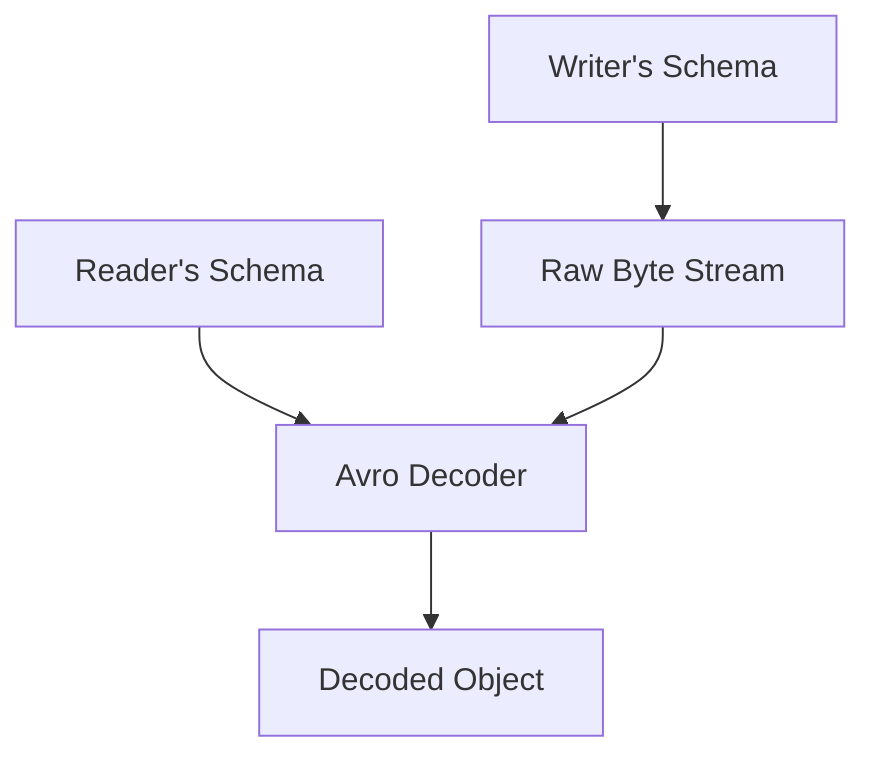

# Chapter 4: Encoding and Evolution

## 🎯 Core Thesis
In data-intensive applications, schemas inevitably change. To ensure application stability, serialization formats must support **Evolution**—allowing old and new code to co-exist in the system simultaneously. This requires strict guarantees of **Backward Compatibility** (new code can read old data) and **Forward Compatibility** (old code can read new data).

---

## 🔑 Key Terminology

*   **Encoding (Serialization/Marshaling)**: The process of translating in-memory object structures into a byte sequence (bytes on the wire or disk).
*   **Decoding (Deserialization/Unmarshaling)**: The reverse process of translating a byte sequence back into in-memory object structures.
*   **Backward Compatibility**: New code can read data that was written by old code.
*   **Forward Compatibility**: Old code can read data that was written by new code.
*   **Rolling Upgrade (Phased Rollout)**: Deploying new software versions to one node at a time rather than shutting down the entire system, ensuring zero-downtime.
*   **Schema Evolution**: The capability of a serialization format to support changes (adding/removing fields) without breaking existing database read/write pipelines.
*   **IDL (Interface Definition Language)**: A language used to define a structured data schema (e.g., used in Protocol Buffers or Apache Thrift).

---

## 📦 Comparison of Serialization Formats

### 1. Language-Specific Formats (Java Serialization, Python pickle)
*   **Verdict**: **Terrible for production.**
*   *Why*: They are highly tied to a specific programming language, making cross-language integration impossible. More critically, they pose severe **security risks** (arbitrary code execution vulnerabilities during decoding) and have poor performance and no schema evolution guarantees.

### 2. Textual Formats (JSON, XML, CSV)
*   **Verdict**: Good for public APIs, bad for heavy internal data pipelines.
*   *Pros*: Human-readable, widely supported, simple.
*   *Cons*: Huge size overhead (verbose keys are repeated in every message), slow parsing, poor handling of floats/binary data.

### 3. Binary Schemed Formats (Protocol Buffers & Apache Thrift)
*   **Verdict**: **Excellent for internal microservice RPCs.**
*   *How they work*: They define schemas via an IDL. Field names are mapped to numeric **Field Tags** (e.g., `1`, `2`) inside the binary stream, completely eliminating the need to transmit verbose field names in the message.

```protobuf
// Protobuf Schema
message User {
    required string name = 1;  // Tag 1
    optional int32 age = 2;    // Tag 2
}
```

#### How Protobuf Schema Evolution Works
*   **Adding Fields**: You can add new fields by assigning them unused tags. 
    *   *Forward Compatibility*: Old code reading new data will see tag numbers it does not recognize and simply skip over those bytes.
    *   *Backward Compatibility*: New code reading old data will find the tag missing and use the default value.
*   **Rules for Evolution**: You must **never** change the tag number of an existing field. You can only add `optional` or `repeated` fields; you can never add a `required` field without breaking backward compatibility.

---

### 4. Schema-Free Binary Formats (Apache Avro)
*   **Verdict**: **Excellent for database backups, event-sourcing (Kafka), and large analytical datasets.**
*   *How it works*: Avro does not use field tags. Instead, the binary data contains *only* raw concatenated values. To decode the bytes, the reader must have the exact **writer's schema** (the schema used to write the data) and the **reader's schema** (the schema the code currently expects).



*   **How Schema Evolution works in Avro**: The engine compares the writer's schema and the reader's schema, matching fields by name. If the reader's schema expects a field that is missing from the writer's schema, it fills it with a declared default value.
*   **Where is the schema stored?**:
    *   *In large files*: The writer's schema is embedded once at the very beginning of the file container.
    *   *In message streams (Kafka)*: A **Schema Registry** is used. The writer includes a tiny 4-byte schema ID at the start of every message, and the reader queries the registry to fetch the matching writer schema.

---

## 📋 Compatibility Evolution Rules

To maintain safe rolling deployments, follow this checklist when evolving your schemas:

> [!WARNING]
> * **Adding a field**: The new field must be `optional` or have a declared `default` value. If it is `required`, old writers will send data without it, and new readers will crash, breaking backward compatibility.
> * **Removing a field**: You can only remove a field that was marked `optional`. You must never reuse a deprecated field's tag number.
