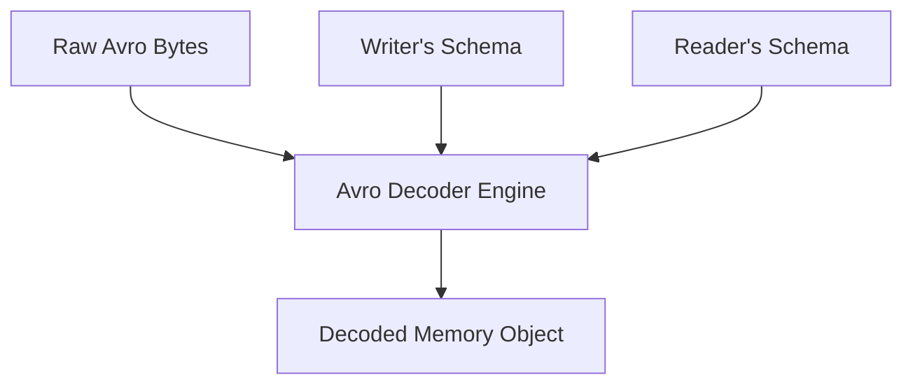

# Chapter 4: Encoding and Evolution (Interview-Grade Deep Dive)

## 🎯 Core Thesis
In large-scale systems, code changes cannot happen instantaneously. To achieve zero-downtime, systems must deploy using **Rolling Upgrades** (phased rollouts), where new software versions are deployed to one node at a time. This physical reality forces systems to support **Schema Evolution**—ensuring that old and new code can read and write each other's data safely. Achieving this requires rigorous mathematical guarantees of **Backward Compatibility** and **Forward Compatibility**.

---

## 🔑 Key Terminology & Academic Definitions

*   **Backward Compatibility**: New code can read data that was written by old code.
*   **Forward Compatibility**: Old code can read data that was written by new code.
*   **Field Tag**: A unique numeric identifier (e.g., `1`, `2`) assigned to a field in binary schemas (Protobuf/Thrift) that is transmitted in place of the verbose field name.
*   **Confluent Schema Registry**: A centralized service used in event streams (Kafka) to store, version, and validate schemas, allowing readers to fetch the exact writer's schema using a compact ID.
*   **Wire Type**: A metadata code in binary streams (e.g., in Protocol Buffers) defining the data category (e.g., Varint, Length-delimited) so readers know how many bytes to parse or skip.
*   **Varint (Variable-length Quantity)**: A binary compression technique that encodes integers using only as many bytes as needed, representing small numbers in a single byte.

---

## 🔁 Compatibility: The Zero-Downtime Pipeline

In an interview, when asked how you deploy software without taking the system down, you must explain **Rolling Upgrades** and the compatibility dependencies they introduce:

```text
Rolling Upgrade Topology (The Dual-State Challenge):
--------------------------------------------------------------------------
Node 1 (v1.0 Old)  <--- Both versions are active in the cluster! --->
Node 2 (v1.0 Old)       Old nodes must parse messages sent by new nodes.
Node 3 (v2.0 New)       New nodes must parse messages sent by old nodes.
--------------------------------------------------------------------------
```

*   **Forward Compatibility (Old reads New)**: If a client hits Node 1 (v1.0) with a payload containing a new field introduced in v2.0, the old code must not crash. It must gracefully ignore or carry over the new field.
*   **Backward Compatibility (New reads Old)**: If a client hits Node 3 (v2.0) with an old v1.0 payload, the new code must successfully parse the message, filling in default values for any missing new fields.

---

## 📦 Binary Serialization Formats

To justify your network payload choices in system design interviews, you must understand how binary serialization formats encode data under the hood.

### 1. Protocol Buffers & Apache Thrift (Field Tag Architecture)
Instead of sending verbose text keys (like `"username"`, `"email"` in JSON), Protobuf and Thrift encode keys as compact **Field Tags**.

```protobuf
// Protocol Buffers Schema (IDL)
message User {
    required string username = 1; // Field Tag 1
    optional string email    = 2; // Field Tag 2
}
```

#### How the Binary Stream is Formatted:
When serialized, the field names `username` and `email` are completely discarded. The binary stream contains only the **Field Tag**, the **Wire Type** (telling the parser how to read the bytes), and the raw **Value**.

```text
Protobuf Binary Stream Representation:
[Tag 1 + Wire Type 2] [Length of "Fred"] ["Fred"] [Tag 2 + Wire Type 2] [Length of "f@lu.com"] ["f@lu.com"]
```

#### Rules of Protobuf Schema Evolution:
1.  **Never Change Tag Numbers**: If you change the tag number of `username` from `1` to `3`, old code reading a new message will search for tag `1` and think the username is missing, breaking compatibility.
2.  **Adding a Field**: You can add new fields by assigning them unused tags.
    *   *Forward Compatibility*: Old code reading new data sees a tag number it does not recognize. It checks the **Wire Type** and safely skips the corresponding bytes.
    *   *Backward Compatibility*: New code reading old data simply finds the tag missing and populates it with the default value.
3.  **The "Required" Hazard**: You must **never** make a new field `required`. If you do, old writers sending data without the new tag will cause new readers to fail validation and crash, violating backward compatibility.

---

### 2. Apache Avro (Schema-Free Binary)
Avro (used in **Kafka** data lakes and Hadoop systems) is the most compact binary format because it transmits **no field tags or types** in the message stream.

```text
Avro Binary Stream Representation:
["Fred"] ["f@lu.com"]  <--- Pure values concatenated. No tags, no metadata!
```

#### How Avro Decoding Works:
Because there are no tags, the bytes cannot be decoded in isolation. To parse the message, the Avro decoder requires:
1.  **The Writer's Schema**: The exact schema used by the application that wrote the data.
2.  **The Reader's Schema**: The exact schema currently expected by the application reading the data.



*   **Matching Resolution**: The Avro Decoder matches the Writer's Schema and the Reader's Schema by column name. If the reader's schema has added a field that is missing from the writer's schema, it populates it with a declared default value.

#### How to Manage Schemas in Production:
*   *Analytical Files (Parquet/Avro)*: The writer's schema is written once at the beginning of the massive file.
*   *Real-time Message Streams (Kafka)*: Sending the full schema with every 100-byte message would waste bandwidth. Instead, we use a **Confluent Schema Registry**.
    1. The producer registers its schema.
    2. The producer prepends a tiny 4-byte **Schema ID** to the front of every Kafka message.
    3. When the consumer receives the message, it reads the Schema ID, fetches the matching writer's schema from the Registry cache, and decodes the payload.

---

## 🏆 System Design Interview Playbook: Choosing Serialization

When designing network communications in interviews, use this playbook to justify your data formatting choices:

```text
Serialization Format Selection Playbook:
─────────────────────────────────────────────────────────────────────────────
Are you building public-facing web APIs consumed by third-party developers, 
mobile clients, or web browsers?
 └── YES ──> Choose JSON over HTTP/REST.
             Justification: Human-readable, native browser parsing, 
             universal compatibility, and simple debugging.

Are you designing high-performance internal microservice communication 
(RPC) requiring low latency and strict interface contracts?
 └── YES ──> Choose PROTOCOL BUFFERS over gRPC.
             Justification: Strict contract enforcement via IDL, compact 
             binary size (field tags), fast parsing, and excellent backward/
             forward compatibility for rolling deployments.

Are you building massive analytical data pipelines (Hadoop/Spark) or high-
throughput real-time event streams (Kafka) with schema verification?
 └── YES ──> Choose APACHE AVRO with a SCHEMA REGISTRY.
             Justification: Smallest possible network payload (zero tags/types 
             on the wire), central schema governance, and robust schema matching.
─────────────────────────────────────────────────────────────────────────────
```
