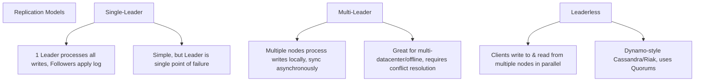

# Chapter 5: Replication

## 🎯 Core Thesis
Replication means keeping a copy of the same data on multiple machines connected via a network. This is done to achieve **high availability** (surviving node crashes), **scalability** (handling more read volume than a single machine can manage), and **low latency** (placing data closer to users geographically). Managing replica synchronization raises the core trade-offs of consistency, speed, and network partitioning tolerance.

---

## 🔑 Key Terminology

*   **Replica**: A database node that stores a copy of the data.
*   **Leader-Based Replication (Active/Passive or Master/Slave)**: One replica is designated as the leader; it processes all writes. Other replicas are followers; they apply the leader's write log to update their data.
*   **Synchronous Replication**: The leader blocks the write until it receives confirmation from all followers that the write has been persisted.
*   **Asynchronous Replication**: The leader processes the write and reports success to the client immediately, syncing to followers in the background.
*   **Replication Lag**: The delay between a write on the leader and its application on a follower.
*   **Read-After-Write Consistency**: A guarantee that if a user updates some data, they will always see their own update when they reload the page.
*   **Monotonic Reads**: A guarantee that if a user reads a sequence of data, they will never see time go backward (i.e., reading from a lagged follower after reading from an up-to-date follower).
*   **Split-Brain**: A catastrophic scenario where two nodes in a cluster simultaneously believe they are the leader, resulting in diverging writes and data corruption.

---

## 🏗️ Replication Topologies



---

## 🛠️ Deep Dive: The Replication Topologies

### 1. Single-Leader Replication
This is the most common model (used by default in PostgreSQL, MySQL, MongoDB).
*   **Writes**: Must go to the leader.
*   **Reads**: Can go to the leader or any follower.

#### High Availability: Failover Workflow
If the leader crashes, one of the followers must be promoted to the new leader:
1.  **Detection**: Nodes ping each other; if a node is unresponsive for a timeout (e.g., 30s), it is declared dead.
2.  **Election**: Followers elect a new leader (usually the follower with the most up-to-date log) via a consensus protocol.
3.  **Reconfiguration**: The system is updated so that clients now send writes to the new leader, and followers consume its log.

> [!CAUTION]
> **Failover Risks**:
> * If asynchronous replication was used, the new leader may be missing writes. If the old leader rejoins, it may have conflicting writes, which are usually discarded, violating durability.
> * **Split-Brain**: If a network partition occurs and both the old leader and a new elected leader process writes simultaneously, data diverges hopelessly. Often resolved by a "fencing" token or shutting down the old leader immediately (STONITH - "Shoot The Other Node In The Head").

---

### 2. Multi-Leader Replication
Used for systems operating across multiple datacenters.
*   *Advantage*: If a datacenter is cut off from the network, local writes still succeed.
*   *Challenge*: **Conflict Resolution**. If User A edits a record in Datacenter 1 and User B edits the same record in Datacenter 2, they must be resolved.
    *   *Resolutions*: Last-Write-Wins (LWW - discards data based on clock timestamp), Collaborative merging (Git), or custom application code.

---

### 3. Leaderless Replication (Dynamo-Style)
Pioneered by Amazon Dynamo, used in Apache Cassandra and Riak.
*   There is no leader. Clients write in parallel to multiple replicas.

#### Quorum Writes and Reads
To guarantee consistency without a leader, we use **Quorums**:
*   Let $N$ be the total number of replicas.
*   Let $W$ be the number of replicas that must confirm a write for it to be successful.
*   Let $R$ be the number of replicas queried during a read.

> [!IMPORTANT]
> **The Quorum Condition**: If $W + R > N$, you are guaranteed **Strong Consistency** because the set of write nodes and the set of read nodes must overlap by at least one node, ensuring the client always reads the latest written value.

```text
Example: N = 3, W = 2, R = 2.
W + R = 4 > 3. (Strict Quorum).
If Node 1 and Node 2 receive a write, and you read from Node 2 and Node 3:
Node 2 will return the new value, Node 3 will return the old value.
The client compares the version numbers and returns the latest value (Node 2's).
```
