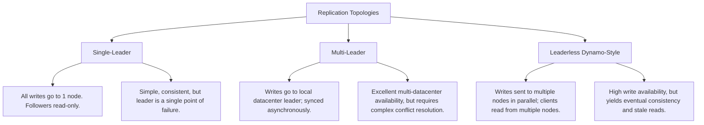
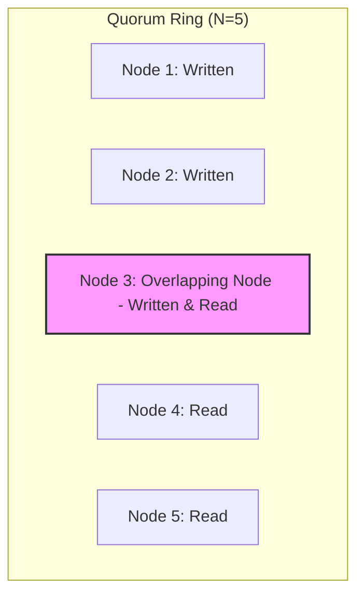

# Chapter 5: Replication (Interview-Grade Deep Dive)

## 🎯 Core Thesis
Replication means keeping copies of the same data on multiple physical machines. It is the baseline architectural pattern for achieving **high availability** (surviving node failures) and **scalability** (offloading read traffic). However, distributing writes across network boundaries forces a fundamental trade-off: you must choose between the simplicity of synchronous updates (which paralyzes write availability if any node fails) and the speed of asynchronous updates (which introduces replication lag, data drift, and complex consistency anomalies).

---

## 🔑 Key Terminology & Academic Definitions

*   **Replication Lag**: The time delay between a write being committed on a leader node and its application on a follower node.
*   **Split-Brain**: A catastrophic failure state where two nodes in a cluster simultaneously believe they are the active leader, resulting in diverging writes and data corruption.
*   **Last-Write-Wins (LWW)**: A conflict-resolution strategy that determines write ordering using physical system timestamps, silently discarding older writes.
*   **Sloppy Quorum**: A leaderless replication configuration where writes are accepted by temporary "helper" nodes outside the primary home nodes during network partitions.
*   **Hinted Handoff**: The process where a sloppy quorum helper node retains a write locally as a "hint" and delivers it back to the primary home node once it rejoins the network.
*   **CRDT (Conflict-Free Replicated Data Type)**: A mathematical data structure (like Grow-only Counters or Observed-Remove Sets) that can be merged concurrently across nodes without conflicts, guaranteeing convergence.
*   **Read-After-Write Consistency**: A guarantee that once a user submits an update, they will always see that update on subsequent page loads (preventing users from seeing their own edits disappear).

---

## 🏗️ Replication Topologies: Architecture & Trade-Offs

In interviews, you must be prepared to compare the three replication topologies:



---

## 🛡️ Deep Dive: The Replication Topologies

### 1. Single-Leader Replication Failover Mechanics
When the leader crashes, the system must perform an automated **Failover** to promote a follower.

#### The Failover Workflow:
1.  **Heartbeat Timeout Detection**: Nodes ping each other. If the leader fails to respond for a threshold (e.g., 30 seconds), it is declared dead.
2.  **Leader Election**: Remaining followers run a consensus protocol (e.g., Raft/Paxos) to elect a new leader. The follower with the most up-to-date transaction log is chosen.
3.  **Client Routing Reconfiguration**: The service registry (e.g., ZooKeeper) is notified, and clients are instructed to route all subsequent writes to the new leader.

> [!CAUTION]
> **Production Failover Hazards**:
> * **Lost Writes**: If asynchronous replication was used, the old leader may have accepted writes that did not reach the followers before it crashed. When the old leader recovers, these writes are typically discarded, violating durability.
> * **Split-Brain Outage**: If a network partition occurs and the old leader is cut off but still running, it may continue to accept writes while the rest of the cluster elects a new leader. Both nodes process writes concurrently, corrupting the database state.
> * **Cascading Crashes**: If the leader crashes due to high load, promoting a new leader can trigger a cascading failure, as the new leader is immediately crushed by the same backlog of traffic, crashing in turn.

---

### 2. Multi-Leader Replication (Cross-Datacenter Synchronization)
Optimized for multi-datacenter active-active architectures.

#### Conflict Resolution Models:
If User A in Datacenter 1 updates a record to `X`, and User B in Datacenter 2 updates the same record to `Y` simultaneously, the databases will diverge. You must justify your resolution strategy in interviews:
1.  **Last-Write-Wins (LWW)**: Discard the update with the older timestamp.
    *   *Hazard*: Physical clocks drift. A fast clock on Node 1 can cause a newer write on Node 2 to be silently thrown away, violating consistency.
2.  **CRDTs (Conflict-Free Replicated Data Types)**:
    *   *Mechanism*: Uses mathematical structures where concurrent operations commute (e.g., set union or addition), guaranteeing that all replicas converge to the exact same state once they receive all updates.
3.  **Operational Transformation (OT)**:
    *   *Mechanism*: An algorithmic framework that re-orders edits dynamically depending on concurrent history (used in collaborative editing tools like Google Docs and Etherpad).

---

### 3. Leaderless Replication (Dynamo-Style)
Pioneered by Amazon Dynamo, used in **Cassandra** and **Riak**.

#### Quorum Mathematics (Strict Consistency Proof)
To ensure strong consistency in a leaderless system, your write set and read set must overlap. We define:
*   $N$: Total replication factor (number of replicas).
*   $W$: Write quorum (number of nodes that must confirm a write to mark it success).
*   $R$: Read quorum (number of nodes queried during a read).

$$\text{Strict Quorum Condition: } W + R > N$$

```text
Mathematical Proof:
If N = 5, and we set W = 3, and R = 3:
W + R = 6. 
Since 6 > 5, the Pigeonhole Principle guarantees that the set of 3 nodes 
written to and the set of 3 nodes read from MUST overlap by at least 1 node. 
This overlapping node acts as the "source of truth," returning the latest version.
```



#### Why Quorums Can Still Return Stale Data (Edge Cases):
Even if $W + R > N$, strong consistency can be broken in production:
1.  **Sloppy Quorums**: If a network partition occurs, the client writes to temporary helper nodes. These updates are isolated until **Hinted Handoff** executes, meaning concurrent reads from primary nodes will return stale data.
2.  **Concurrent Writes (LWW)**: If two writes occur at the same time, clock drift can cause the database to pick the wrong "latest" version.
3.  **Failed Writes**: If a write succeeds on $2$ out of $3$ nodes and then aborts/fails, the database does not automatically rollback the completed writes. A subsequent read may still retrieve the partially written data.

---

## 🏆 System Design Interview Playbook: Replication Selection

When designing a distributed service, use this playbook to justify your replication architecture:

```text
Replication Selection Playbook:
─────────────────────────────────────────────────────────────────────────────
Are you building a standard user-facing transaction system requiring simple, 
predictable consistency and easy setups (e.g., retail, banking, SaaS)?
 └── YES ──> Choose SINGLE-LEADER REPLICATION (PostgreSQL, MySQL).
             Justification: Simple writes, guaranteed ordering, native 
             Read-After-Write consistency.

Are you designing a global, multi-region application that must remain fully 
writable even if entire trans-oceanic network cables are cut?
 └── YES ──> Choose MULTI-LEADER REPLICATION (Active-Active Datacenters).
             Justification: Writes are accepted locally inside each region 
             instantly; survives massive wide-area network partitions.

Are you building a massive, globally scaled system requiring extreme write 
availability and high-throughput ingestion (e.g., metrics, shopping carts)?
 └── YES ──> Choose LEADERLESS REPLICATION (Cassandra).
             Justification: Dynamo-style parallel writes eliminate leader 
             bottlenecks; quorum parameters (W, R) can be tuned to balance latency.
─────────────────────────────────────────────────────────────────────────────
```
