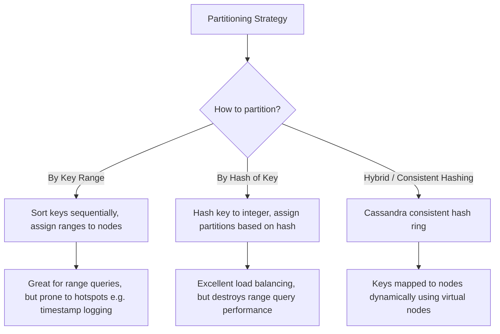

# Chapter 6: Partitioning (Sharding)

## 🎯 Core Thesis
For very large datasets or high query throughput, replication is not enough; we must break the dataset down into smaller, independent chunks called **Partitions** (known as **Shards** in MongoDB/Elasticsearch, and **vnodes** in Cassandra). The primary goal of partitioning is to distribute data and query load evenly across nodes, avoiding **Hotspots** (nodes with disproportionately high load).

---

## 🔑 Key Terminology

*   **Partitioning (Sharding)**: Breaking a single database down into independent subsets of data, with each node handling a specific partition.
*   **Skew**: An uneven distribution of data or query load across partitions.
*   **Hotspot**: A partition or node that receives an extremely high volume of traffic/data, acting as a performance bottleneck.
*   **Consistent Hashing**: A partitioning strategy that maps keys to nodes on a logical ring using hash values. This minimizes data movement when nodes are added or removed.
*   **Secondary Index**: An index on a non-primary key field. This introduces severe query overhead in partitioned databases.
*   **Scatter-Gather Query**: Querying all partitions in parallel because the database cannot determine which partition holds the requested secondary index data.
*   **Rebalancing**: The process of moving partitions from one node to another to redistribute load when hardware is added or removed.

---

## 🗺️ Partitioning Strategies

### 1. Partitioning by Key Range (e.g., Alphabetical or Date-based)
*   *How*: Node 1 holds keys `A` to `C`, Node 2 holds `D` to `F`, etc.
*   *Pros*: Range scans are highly efficient. For example, `SELECT * FROM sensor_data WHERE timestamp >= 1000 AND timestamp < 2000` is routed to a single partition.
*   *Cons*: Prone to severe **Skew/Hotspots**. If you partition by date and perform high-volume writes for "today," all writes hit the single node holding today's partition while other nodes sit idle.

### 2. Partitioning by Hash of Key
*   *How*: A hash function (e.g., MurmurHash3) is applied to the primary key, mapping it to a 32-bit integer. Partitions are assigned ranges of hash values.
*   *Pros*: Eliminates hotspots and guarantees even distribution of data.
*   *Cons*: Range queries must be executed on all partitions in parallel, which is highly inefficient.

---

## 🔍 The Secondary Index Challenge
Primary key partitioning is simple because the primary key maps directly to a single partition. However, searching by a secondary index (e.g., searching for all cars that are `color = 'red'`) is much harder. There are two main ways to handle secondary indexes:

### Option A: Document-Partitioned Indexes (Local Indexes)
Every partition maintains its own secondary index, mapping only the documents stored *within that partition*.
*   *Write*: Highly efficient. The database only writes to the local partition's index.
*   *Read*: Highly inefficient. To find all "red" cars, the query must be sent to **every single partition** (a **Scatter-Gather** query), which increases latency and wastes CPU.

### Option B: Term-Partitioned Indexes (Global Indexes)
The secondary index is partitioned globally across the entire cluster.
*   *Write*: Slow and complex. A write to a document in Partition 1 might require updating the color index stored in Partition 3, requiring distributed transactions or asynchronous updates.
*   *Read*: Extremely fast. A query for "red" cars can be sent directly to the single partition holding the global index for "red".

---

## ⚖️ Partition Rebalancing (Scaling Up/Down)
When adding new nodes to a cluster, you must move partitions to balance the load.

> [!CAUTION]
> **Anti-Pattern: Hash Mod N ($key \bmod N$)**
> * Do **not** partition keys using `hash(key) % N` where $N$ is the number of nodes. 
> * If $N$ changes (e.g., from 9 to 10 nodes), almost **every single key** will hash to a new node, causing a massive, catastrophic storm of data movement across the network.

### Correct Rebalancing Strategies
1.  **Fixed Number of Partitions**: Create many more partitions than nodes (e.g., 1000 partitions for 10 nodes). When a new node is added, it takes a few partitions from each existing node.
2.  **Dynamic Partitioning**: Used in HBase/RethinkDB. When a partition grows larger than a threshold (e.g., 10GB), it automatically splits into two partitions, and one is moved to another node.
3.  **Partition Proportional to Nodes**: Cassandra allocates a fixed number of partitions per node. When a new node is added, it randomly selects partitions to split and take over.
