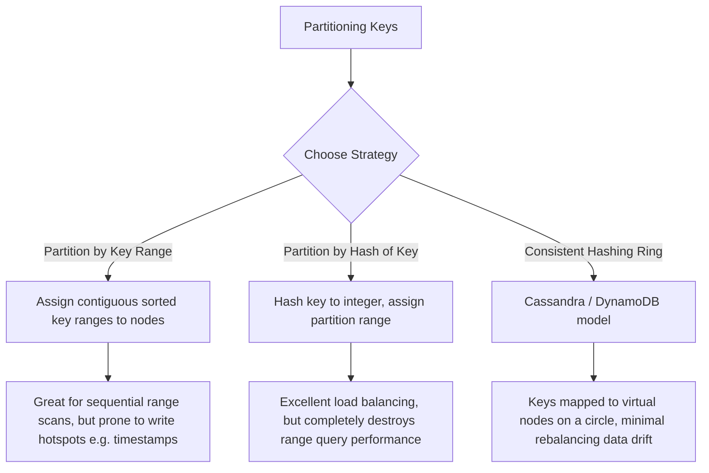

# Chapter 6: Partitioning (Sharding) (Interview-Grade Deep Dive)

## 🎯 Core Thesis
For massive datasets or extreme traffic, replication is insufficient because a single database node cannot store all data or handle the query workload. We must split the database into independent, horizontal slices called **Partitions** (or **Shards**). The absolute mandate of partitioning is to distribute data and read/write load evenly across physical hardware nodes. Failing to do this creates **Skew** and **Hotspots**, which can completely disable your cluster regardless of how many nodes you add.

---

## 🔑 Key Terminology & Academic Definitions

*   **Partitioning (Sharding)**: The database design pattern of dividing a single logical database into independent subsets of data, with each physical machine responsible for a single partition.
*   **Skew**: An uneven distribution of data or query load across partitions (e.g., Node 1 holds $90\%$ of the database data, while Nodes 2-10 sit empty).
*   **Hotspot**: A single node or partition that experiences a disproportionately high rate of traffic, acting as a cluster-wide performance bottleneck.
*   **Consistent Hashing**: A partitioning model that maps both nodes and keys to a shared circular integer hash space (ring). This ensures that adding or removing a node only requires moving a tiny fraction ($1/N$) of the total keys.
*   **Scatter-Gather Query**: A query routing pattern where a database coordinator must broadcast a query to **every partition in the cluster** and merge the results because it does not know which node holds the requested data.
*   **Rebalancing**: The process of shifting partitions between physical nodes to redistribute storage and CPU load when scaling the cluster.

---

## 🗺️ Partitioning Strategies: Range vs. Hash sharding



---

## 🛡️ Deep Dive: Sharding Mechanisms

### 1. Partitioning by Key Range
*   *Mechanism*: Keys are sorted sequentially. Node 1 holds keys `A` to `C`, Node 2 holds keys `D` to `F`, etc.
*   *System Design Implication*: Excellent for **Range Scans**. For example, if you query all transactions between timestamp `1000` and `2000`, the query is routed directly to the single node holding that range.
*   *The Hotspot Hazard*: If you partition an application logging database by timestamp, today's writes will all share today's timestamp. This forces **100% of the write load** onto a single node holding the current date partition, leaving the rest of the expensive cluster completely idle.

### 2. Partitioning by Hash of Key (Consistent Hashing)
To eliminate skew and hotspots, the primary key is passed through a hash function (like MurmurHash3) to yield a pseudo-random integer.

#### Consistent Hashing Ring Mechanics:
Traditional sharding using `hash(key) % N` (where $N$ is the number of nodes) is a **catastrophic anti-pattern**. If you scale the cluster from 9 to 10 nodes, almost every single key hashes to a new node, causing a massive, network-saturating data migration.

**Consistent Hashing solves this:**
1. Node identifiers and keys are hashed into a shared circular ring of integers (e.g., $0$ to $2^{32}-1$).
2. A key is assigned to the first node encountered when traversing the ring clockwise from the key's hash position.
3. *Scaling Up*: When a new Node $C$ is added, it only takes a subset of keys from its immediate clockwise neighbor. The other nodes do not move a single byte of data.

```text
Consistent Hashing Ring:
          [Node A (hash: 100)]
               /        \
              /          \
  [Node C (hash: 300)]   [Node B (hash: 200)]
```

---

## 🔍 The Secondary Index Challenge
Primary keys are easily routed to a single partition. However, secondary indexes (indexing fields other than the primary sharding key) introduce a major architectural penalty:

### Option A: Document-Partitioned Indexes (Local Indexes)
*   *Mechanism*: Each partition maintains its own secondary index, mapping only the documents stored inside its local boundaries.
*   *Write Path (Fast)*: When a document is written, the database only updates the index located on that local partition.
*   *Read Path (Scatter-Gather)*: If you query `SELECT * FROM cars WHERE color = 'red'`, the database coordinator **does not know** which partition holds the red cars. It must broadcast the query to **every single partition** (Scatter-Gather). If even one partition is slow, the entire query latency spikes (long-tail latency).

### Option B: Term-Partitioned Indexes (Global Indexes)
*   *Mechanism*: The secondary index is partitioned globally across the entire cluster, completely decoupled from the document partitioning key.
*   *Write Path (Slow)*: Modifying a document in Partition 1 that contains a red car requires the database to perform a cross-node write to update the color index partition stored on Partition 3. This requires slow distributed transactions or asynchronous syncing.
*   *Read Path (Fast)*: A query for `color = 'red'` is routed directly to the single partition holding the global index for "red".

---

## ⚖️ Partition Rebalancing Strategies

When adding new hardware to scale out, how do we move partitions safely?

1.  **Fixed Partitions**: You pre-allocate a large, fixed number of partitions (e.g., 1000 partitions) for a cluster of 10 nodes. Each node holds 100 partitions. When an 11th node is added, it takes a few partitions from each existing node.
    *   *Advantage*: Extremely simple; easy to reason about.
2.  **Dynamic Partitioning (HBase/RethinkDB)**:
    *   *Mechanism*: When a partition grows larger than a configured size threshold (e.g., 10GB), the database automatically splits it into two equal partitions. One partition remains, and the other is shifted to a different node.
3.  **Node-Proportional Partitions (Cassandra Virtual Nodes)**:
    *   *Mechanism*: The number of partitions is proportional to the number of nodes. Every physical node is allocated a fixed number of **virtual nodes (vnodes)** on the consistent hashing ring. This ensures perfect statistical distribution of load.

---

## 🏆 System Design Interview Playbook: Designing Sharding Keys

When asked how to shard a database in an interview, follow this structural playbook:

```text
Sharding Key Design Playbook:
─────────────────────────────────────────────────────────────────────────────
Step 1: Identify the primary access path.
        For a social platform, this is usually `user_id`. Sharding by `user_id` 
        ensures all of a single user's data (posts, profile) is stored on the 
        same node, allowing fast local queries without cross-node joins.

Step 2: Detect skew and hotspot risks.
        If you sharded by `user_id`, what happens when a celebrity posts? 
        The node holding that celebrity's `user_id` partition will be crushed 
        by traffic.

Step 3: Apply Shard Key Salting (Mitigation).
        To solve celebrity hotspots, append a random two-digit suffix (a "salt", 
        e.g., `celebrity_id_01` to `celebrity_id_99`) to the partition key for 
        extremely popular accounts. This splits the celebrity's writes evenly 
        across 100 different partitions, protecting database health.
─────────────────────────────────────────────────────────────────────────────
```
