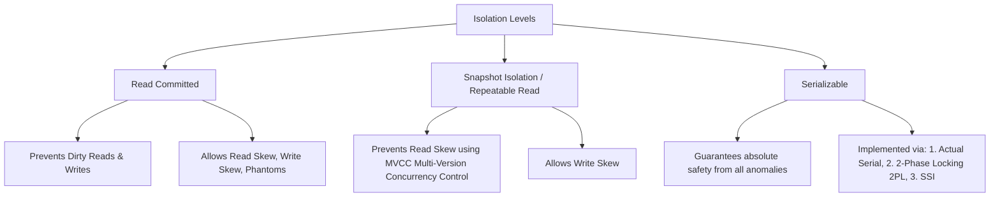

# Chapter 7: Transactions

## 🎯 Core Thesis
Transactions are an abstraction layer that simplifies database programming. By grouping multiple reads and writes into a single logical unit of execution, the database guarantees that either **all** operations succeed (commit) or **all** fail (abort/rollback), shielding the application developer from having to handle partial failure states.

---

## 🔑 Key Terminology

*   **ACID**: Atomicity, Consistency, Isolation, Durability.
*   **Atomicity**: "All-or-nothing." If a transaction aborts, all changes made within it are completely undone (rolled back).
*   **Isolation**: Concurrently executing transactions must not interfere with each other. The database behaves *as if* transactions executed serially.
*   **Dirty Read**: Transaction A reads data that has been modified by Transaction B but not yet committed.
*   **Dirty Write**: Transaction A overwrites data that has been written by Transaction B but not yet committed.
*   **Read Skew (Non-repeatable Read)**: A user sees different values for the same record when reading it at different times within the same transaction.
*   **Write Skew**: A race condition where two transactions read the same data, make independent decisions based on it, and write updates that violate a business rule (e.g., two doctors clicking "leave shift" simultaneously when at least one must remain).
*   **Phantom Read**: A transaction queries rows matching a search condition, and another concurrent transaction inserts/deletes rows that affect the query result.

---

## 🚧 Transaction Isolation Levels

To balance performance and correctness, databases implement different **Isolation Levels**. Higher isolation levels prevent more anomalies but reduce concurrent throughput.

---

## 🛡️ Deep Dive: The Isolation Levels

### 1. Read Committed
The baseline standard for most relational databases (default in PostgreSQL, SQL Server).
*   *Guarantees*:
    1.  No Dirty Reads (reads only committed data).
    2.  No Dirty Writes (overwrites only committed data).
*   *Implementation*: 
    *   To prevent dirty writes, the database uses **row-level locks**. A transaction must acquire a lock on a row before writing and hold it until committed/aborted.
    *   To prevent dirty reads, the database remembers the old committed value of the row while a write lock is active. Readers read this old value without blocking.

---

### 2. Snapshot Isolation (Repeatable Read)
The most popular level for analytical and long-running backup queries.
*   *Guarantees*: Prevents **Read Skew**. A transaction reads a consistent snapshot of the database taken at the exact moment the transaction began.
*   *Implementation: MVCC (Multi-Version Concurrency Control)*:
    *   To support snapshot isolation, the database keeps multiple versions of a row. When a transaction writes to a row, it creates a new version with a transaction ID (`txid`).
    *   Each row has a `created_by_txid` and `deleted_by_txid`. A transaction can only see row versions where `created_by_txid` is less than or equal to its own transaction ID and has already committed, and `deleted_by_txid` is either empty or uncommitted.
    *   **Readers never block writers, and writers never block readers.**

---

### 3. Serializability
The strongest isolation level. It guarantees that the concurrent execution of transactions yields the exact same state as if they were executed one by one, serially.

#### How to Implement Serializability:
1.  **Actual Serial Execution**: 
    *   Executing all transactions on a single CPU thread.
    *   *Pros*: Zero lock overhead.
    *   *Cons*: Throughput is limited to a single CPU core; transactions must be short and hold all data in memory (Redis, VoltDB).
2.  **Two-Phase Locking (2PL)**:
    *   Writers block readers, and readers block writers.
    *   Shared locks are acquired for reading; exclusive locks are acquired for writing. In Phase 1, locks are acquired; in Phase 2 (commit/abort), locks are released.
    *   *Cons*: Terrible performance. High latency and frequent **Deadlocks**.
3.  **Serializable Snapshot Isolation (SSI)**:
    *   An optimistic concurrency control model.
    *   Transactions execute concurrently on a snapshot of data without blocking. When a transaction attempts to commit, the database checks if any read-write conflicts occurred (e.g., if another transaction modified data that this transaction read). If a conflict is found, the committing transaction is aborted and must retry.
    *   *Pros*: High read performance; scales beautifully (default serializable model in modern PostgreSQL).
