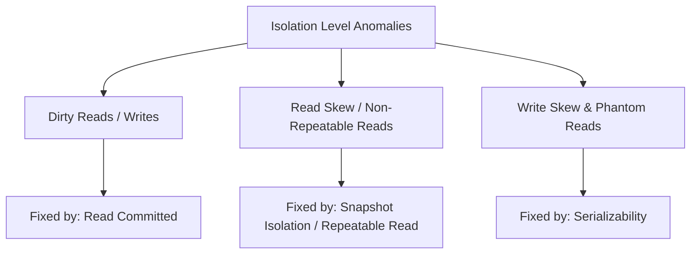

# Chapter 7: Transactions (Interview-Grade Deep Dive)

## 🎯 Core Thesis
Transactions are a powerful abstraction layer that isolates application code from the complexities of concurrent execution and physical system failures. By grouping a set of reads and writes into an atomic unit, the database guarantees the **ACID** properties, allowing developers to treat the entire sequence as a single, indivisible operation.

---

## 🔑 Key Terminology & Academic Definitions

*   **ACID**: Atomicity, Consistency, Isolation, Durability.
*   **Atomicity**: The "abortability" guarantee. If any statement in the transaction fails, the entire transaction is rolled back, leaving the database state completely untouched.
*   **Consistency**: A semantic invariant of the database schema (e.g., balance $\ge 0$). *Unlike A, I, and D, Consistency is actually the application's responsibility; the database merely enforces the rules (keys, checks) defined by the developer.*
*   **Isolation**: The concurrency guarantee. Concurrently executing transactions must run without interfering with each other. The database guarantees that the end state is identical to running them sequentially.
*   **Durability**: The persistence guarantee. Once a transaction commits, its modifications are permanently recorded in non-volatile storage (via `fsync` of the Write-Ahead Log) and will survive subsequent power losses or system crashes.
*   **MVCC (Multi-Version Concurrency Control)**: An isolation technique where the database keeps multiple versions of a row concurrently, allowing readers to read a consistent snapshot of the data without acquiring locks or blocking writers.
*   **2PL (Two-Phase Locking)**: A pessimistic concurrency control algorithm where transactions must acquire shared locks to read and exclusive locks to write, separating lock acquisition (growing phase) from lock release (shrinking phase).
*   **SSI (Serializable Snapshot Isolation)**: An optimistic concurrency control algorithm that executes transactions concurrently on snapshots, but aborts and retries them if a dependency cycle is detected upon commit.

---

## 🚧 Concurrency Anomalies & Interview Defending

In system design interviews, you must be able to explain, step-by-step, the exact anomalies that occur when isolation levels are relaxed.



---

### 1. Dirty Reads & Dirty Writes

#### Dirty Read (Reading uncommitted data)
*   **Definition**: Transaction A modifies a row. Transaction B reads that row *before* Transaction A commits or aborts.
*   **Interview Scenario (Explain to an interviewer)**:
    1.  **Time 1**: Tx A initiates and decrements Account Balance from $100 to $50.
    2.  **Time 2**: Tx B initiates, reads the balance, sees $50, and denies a credit application.
    3.  **Time 3**: Tx A fails due to a constraint violation and rolls back. The balance reverts to $100.
    4.  *The Bug*: Tx B made a critical business decision based on a transient state that technically never existed.

#### Dirty Write (Overwriting uncommitted data)
*   **Definition**: Transaction A writes to a row. Transaction B overwrites that row *before* Transaction A commits.
*   **Interview Scenario**:
    1.  **Time 1**: Tx A updates a concert ticket status to `RESERVED` for User 1.
    2.  **Time 2**: Tx B updates the same ticket status to `RESERVED` for User 2.
    3.  **Time 3**: Tx A aborts and triggers a rollback, reverting the status back to `AVAILABLE`.
    4.  *The Bug*: Tx B's write (User 2) is lost, and the database is left in a corrupted state where User 2 thinks they purchased a ticket, but the DB shows it is `AVAILABLE`.

---

### 2. Read Skew (Non-repeatable Reads)

*   **Definition**: A transaction reads the same record twice during its execution but sees different values because a concurrent transaction updated and committed the record in between.
*   **Interview Scenario (The Balance Sheet Audit)**:
    1.  **Time 1**: Account A has $500; Account B has $500 (Total = $1000).
    2.  **Time 2**: Tx 1 (Auditor) reads Account A ($500).
    3.  **Time 3**: Tx 2 (Transfer) transfers $100 from B to A. It updates A to $600, B to $400, and **commits**.
    4.  **Time 4**: Tx 1 (Auditor) reads Account B ($400).
    5.  *The Bug*: Tx 1 calculates a total balance of $900 ($500 + $400). $100 appears to have vanished. If Tx 1 runs again, it sees $1000 ($600 + $400). This temporary mismatch is **Read Skew**.

---

### 3. Write Skew & Phantom Reads

#### Write Skew (The Semantic Race Condition)
*   **Definition**: Two transactions read the same set of records, make independent decisions that do not overlap in write targets, but their combined effect violates a global business constraint.
*   **Interview Scenario (Doctor On-Call)**:
    *   *Constraint*: At least one doctor must remain active on-call.
    *   *State*: Doctors Alice and Bob are currently on-call.
    1.  **Time 1**: Alice initiates Tx 1 to leave her shift. Tx 1 reads active doctors -> Sees 2. 
    2.  **Time 2**: Bob initiates Tx 2 to leave his shift. Tx 2 reads active doctors -> Sees 2.
    3.  **Time 3**: Tx 1 updates Alice's status to `OFF-CALL` and commits.
    4.  **Time 4**: Tx 2 updates Bob's status to `OFF-CALL` and commits.
    5.  *The Bug*: Both transactions commit because they modified *different* rows (Tx 1 updated Alice's row, Tx 2 updated Bob's). However, active doctors = 0, violating the constraint.

#### Phantom Read
*   **Definition**: A transaction queries rows matching a search criteria, and a concurrent transaction inserts, updates, or deletes rows, changing the result of the query if it is run again.
*   **Interview Scenario**:
    1.  **Time 1**: Tx 1 queries all open rooms in a hotel -> Sees Room 101 and 102.
    2.  **Time 2**: Tx 2 inserts a new row (Room 103) as open and commits.
    3.  **Time 3**: Tx 1 queries again -> Sees Rooms 101, 102, and the "phantom" Room 103.

---

## ⚙️ Transaction Isolation Levels Under the Hood

To defend your designs in interviews, you must explain the underlying data structures and locking models of each isolation level.

### 1. Read Committed
*   **Guarantees**: Prevents Dirty Reads and Dirty Writes.
*   **Write Locking**: Implemented via **exclusive row-level locks**. Any transaction wanting to write to a row must acquire the lock. Other writers are blocked until the transaction commits or aborts.
*   **Non-blocking Reads**: Readers do not acquire locks. Instead, for every written row, the database remembers the **last committed value** and the **current uncommitted value** (held by the active writer transaction). All concurrent readers are automatically routed to the old committed value, ensuring reads are extremely fast and never block.

---

### 2. Snapshot Isolation (Repeatable Read)
*   **Guarantees**: Prevents Read Skew (Non-repeatable Reads).
*   **Implementation: Multi-Version Concurrency Control (MVCC)**:
    When Snapshot Isolation is enabled, the database maintains multiple physical versions of each row.

#### The MVCC Visibility Rules:
Each row in the database is tagged with two metadata fields:
*   `created_by_txid`: The transaction ID that inserted the row.
*   `deleted_by_txid`: The transaction ID that deleted the row (empty if active).

```text
Database Table State (Snapshot Isolation View for Tx 30):
========================================================================
Row ID | Value    | created_by_txid | deleted_by_txid | Visible to Tx 30?
------------------------------------------------------------------------
1      | "Alice"  | 10              | 25              | NO (Deleted by committed Tx 25)
1      | "Alisha" | 25              | [Empty]         | YES (Created by committed Tx 25 <= 30)
2      | "Bob"    | 35              | [Empty]         | NO (Created by Tx 35, which is > 30)
```

When Transaction `30` begins, the database takes a snapshot of all active transactions. A row is **visible** to Transaction `30` if and only if:
1.  The transaction that created the row (`created_by_txid`) had already **committed** before Transaction `30` started.
2.  The `created_by_txid` is $\le 30$.
3.  The row was not marked for deletion, or if it was, the deleting transaction (`deleted_by_txid`) was uncommitted or started *after* Transaction `30` began.

> [!TIP]
> **MVCC Golden Rule**: **Readers never block writers, and writers never block readers.** This eliminates read-performance bottlenecks under heavy write loads.

---

### 3. Serializability
The gold standard of correctness. It guarantees that concurrently executing transactions yield the exact same state as if they were executed one by one, serially.

#### Approach A: Actual Serial Execution (Single-Threaded Engines)
*   **How it works**: The database runs on a single CPU thread, executing transactions sequentially.
*   **When it works**:
    1.  Transactions must fit entirely in RAM (no disk I/O wait).
    2.  Transactions must be extremely short and written as stored procedures to avoid network round-trip delays (used in **Redis** and **VoltDB**).
*   **Interview Trade-off**: High throughput for simple keyspace operations, but fails if queries are CPU-intensive or require complex joins.

#### Approach B: Two-Phase Locking (2PL)
*   **How it works**: A pessimistic model where readers block writers, and writers block readers.
*   **Rules of 2PL**:
    1.  If Transaction A wants to read a row, it must acquire a **Shared Lock (S-lock)**. Multiple transactions can hold S-locks on the same row.
    2.  If Transaction A wants to write to a row, it must acquire an **Exclusive Lock (X-lock)**. Only one transaction can hold an X-lock.
    3.  If a row has an S-lock, another transaction wanting to write must wait.
    4.  If a row has an X-lock, another transaction wanting to read or write must wait.
    5.  **The Two Phases**:
        *   *Phase 1 (Growing)*: The transaction acquires locks as needed but cannot release any.
        *   *Phase 2 (Shrinking)*: The transaction releases all locks upon commit or abort; it cannot acquire new ones.

> [!WARNING]
> **Do not confuse 2PL (Two-Phase Locking) with 2PC (Two-Phase Commit)!**
> *   **2PL** is a concurrency control protocol to guarantee **Isolation** on a single node.
> *   **2PC** is an atomic commitment protocol to guarantee **Atomicity** across multiple distributed nodes.

#### Approach C: Serializable Snapshot Isolation (SSI)
*   **How it works**: An optimistic model. Transactions execute concurrently on snapshots (MVCC) without acquiring locks.
*   **Conflict Detection**:
    The database tracks when a transaction reads data that has been modified by another concurrent transaction.
    1.  **Detecting stale reads**: If Transaction A reads a row, and Transaction B updates that row *before* A commits, the DB flags the read as stale.
    2.  **Detecting uncommitted writes**: If Transaction A reads a row, and Transaction B writes to it but has not committed, the DB flags the dependency.
*   **Commit Decision**: Upon commit, the database checks the dependency graph. If it finds a cycle (indicating a write skew or phantom read anomaly), it aborts the committing transaction and forces a retry.
*   **Interview Trade-off**: Excellent read/write performance. Scalable across multi-core systems. However, if conflict rates are extremely high, abort rates skyrocket, degrading performance due to repeated retries.

---

## 🏆 System Design Interview Playbook: Choosing Isolation Levels

When designed a system in an interview, use this decision tree to justify your choice of transaction isolation:

```text
Decision Tree: Which Isolation Level to Pick?
─────────────────────────────────────────────────────────────────────────────
Is your application read-heavy with strict latency SLA (e.g. social media)?
 └── YES ──> Choose SNAPSHOT ISOLATION (MVCC).
             Reads never block writes. Exceptional throughput.
             
Does your query perform analytical aggregations across millions of records?
 └── YES ──> Choose SNAPSHOT ISOLATION (MVCC).
             Guarantees a consistent point-in-time snapshot. Prevents read skew.

Are you handling financial ledger balances or ticket inventory where 
write-skew/phantom anomalies cause real-world double-spending?
 └── YES ──> Choose SERIALIZABILITY.
             If Postgres: Choose SSI (highly scalable, optimistic).
             If Redis: Choose Actual Serial Execution (in-memory, single-threaded).
             If legacy SQL: Choose 2PL (highly pessimistic, lock-heavy, slow).
─────────────────────────────────────────────────────────────────────────────
```
