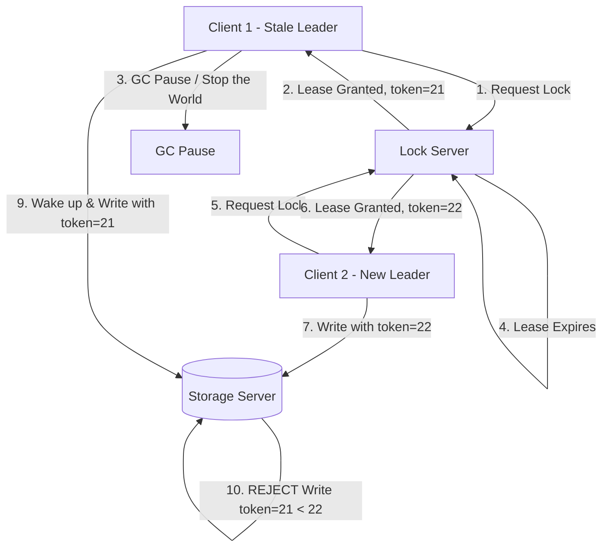

# Chapter 8: The Trouble with Distributed Systems

## 🎯 Core Thesis
In distributed systems, we must operate under the assumption that everything that *can* go wrong *will* go wrong. Unlike a single-computer system where a hardware fault leads to a complete crash, a distributed system experiences **Partial Failures**—where some nodes work perfectly while others are dead, slow, or disconnected. The network is unreliable, clocks drift, and nodes can experience temporary pauses (GC pauses), making it impossible to establish an absolute global truth.

---

## 🔑 Key Terminology

*   **Partial Failure**: A state where some components of a distributed system are broken while others are functioning, leaving the system in an indeterminate, non-deterministic state.
*   **Asynchronous Network Model**: A network model where messages can be delayed indefinitely, reordered, or lost. There are no timing guarantees.
*   **Clock Drift**: The phenomenon where physical hardware clocks on different machines gradually drift apart over time due to temperature, vibration, and component quality.
*   **Time-of-day Clock (Epoch time)**: A clock linked to a physical standard (e.g., UTC synchronized via NTP). It can jump backward or forward (e.g., during NTP adjustments or leap seconds), making it dangerous for measuring elapsed time.
*   **Monotonic Clock**: A physical clock that only ticks forward at a constant rate. Used exclusively for measuring intervals of elapsed time (e.g., `System.nanoTime()`).
*   **Garbage Collection (GC) Pause**: A temporary freeze in application execution (stop-the-world) while the runtime reclaims memory. This can make a node appear "dead" to the rest of the cluster.
*   **Fencing Token**: A monotonically increasing number (e.g., lock epoch) issued by a lock service to ensure that a client with a stale lease cannot perform writes.

---

## 🌐 The Network: Unreliable Channels

In a distributed system, all communications go through an ethernet cable or wireless network. The network is an **asynchronous** medium. If you send a request to a node and receive no response, you cannot distinguish between:
1.  The request was lost.
2.  The request is still in a queue (network congestion).
3.  The destination node crashed.
4.  The destination node processed the request, but the response was lost.
5.  The response was delayed and will arrive later.

> [!WARNING]
> There is only one tool to handle network uncertainty: **Timeouts**. If no response is received within a timeout period, the sender must assume the target is dead and take action. However, setting the timeout too low causes false positives (declaring healthy but busy nodes dead), while setting it too high causes slow failovers.

---

## ⏰ The Clock Dilemma

Distributed systems rely on clocks to determine order (e.g., Last-Write-Wins replication). However, physical clocks on different computers cannot be perfectly synchronized.

### Time-of-day Clocks vs Monotonic Clocks
*   **Time-of-day Clocks (e.g., `System.currentTimeMillis()`)**:
    *   *Mechanism*: Synchronized periodically with NTP servers.
    *   *Danger*: If the local clock is ahead of the NTP server, NTP will force the clock to **jump backward**. If you use this clock to order writes, a newer write can be assigned an older timestamp and get silently discarded!
*   **Monotonic Clocks**:
    *   *Mechanism*: Measures the CPU's internal clock cycles. Guaranteed to never jump backward or forward.
    *   *Use Case*: Calculating elapsed time intervals (e.g., timeouts, query duration).

### Google's TrueTime API (Spanner)
To solve clock synchronization drift, Google Spanner uses GPS receivers and atomic clocks in every datacenter.
*   The TrueTime API does not return a single timestamp, but a time interval `[earliest, latest]`, representing the current time $\pm \epsilon$ (drift error, usually < 7ms).
*   If Transaction A commits at `[10:00:00, 10:00:07]` and Transaction B starts, the database will **force Transaction B to wait** until the actual physical time has passed `10:00:07`. This guarantees absolute serializability across distributed transactions.

---

## 🛡️ Establishing Truth: Fencing Tokens
A classic distributed bug occurs when a node believes it is still the leader (e.g., due to a temporary GC pause), but its lease has expired and a new leader has been elected.

*   **Fencing Token Pattern**: The Storage Server maintains the highest token number it has ever processed. When Client 1 attempts to write with token `21` after its GC pause, the storage server rejects the write because it has already processed token `22` from Client 2.
