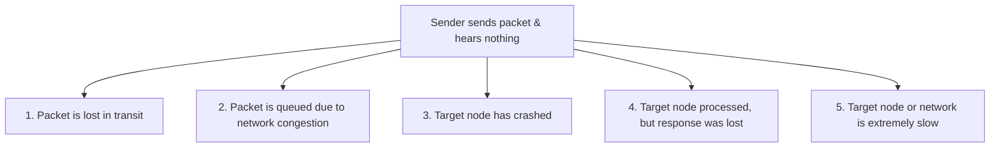
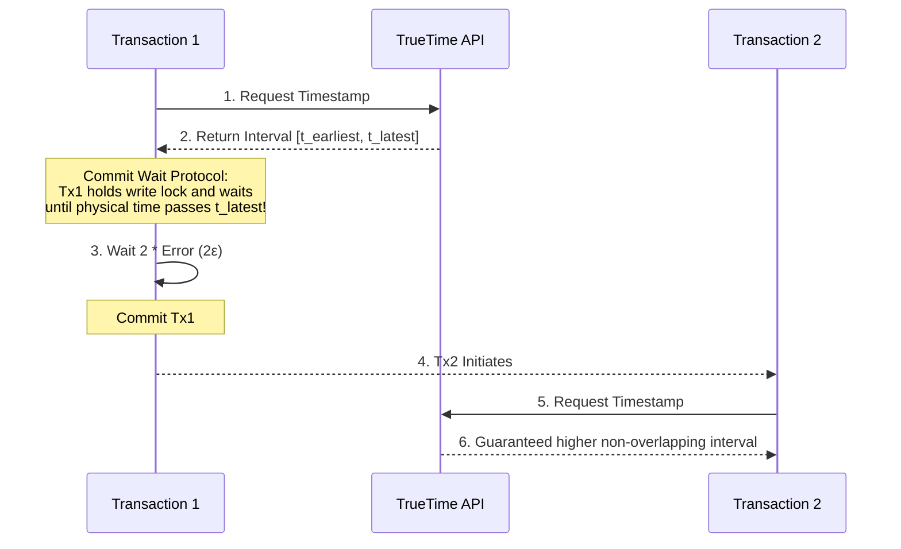

# Chapter 8: The Trouble with Distributed Systems (Interview-Grade Deep Dive)

## 🎯 Core Thesis
Distributed systems operate under a harsh physical constraint: **Partial Failures**. Unlike a single-node system where a hardware fault leads to a clean crash, a distributed system experiences states where some nodes are functional, some are dead, and others are extremely slow or isolated by network partitions. In interviews, you must demonstrate a "paranoid design" mindset, showing that you do not trust the network, do not trust physical clocks, and do not trust nodes to know their own status without distributed consensus.

---

## 🔑 Key Terminology & Academic Definitions

*   **Partial Failure**: A distributed state where components are broken, degraded, or delayed while others are operating normally, creating non-deterministic system behaviors.
*   **Asynchronous Network**: A network model where packets can be delayed indefinitely, reordered, duplicated, or silently dropped, with no timing guarantees.
*   **Clock Drift**: The physical phenomenon where quartz crystals inside motherboards gradually drift away from actual time due to hardware quality, vibration, or temperature skew.
*   **Time-of-day Clock (Wall-clock)**: A physical clock synchronized via NTP (Network Time Protocol) to reflect epoch time. It is **non-monotonic**—it can jump backward or forward during NTP synchronization.
*   **Monotonic Clock**: A highly stable hardware timer that only increments forward at a constant rate, used exclusively to measure elapsed intervals (e.g., `System.nanoTime()`).
*   **Stop-the-World GC Pause**: A JVM or runtime freeze where execution threads are suspended to collect memory, during which a node cannot respond to heartbeats.
*   **Fencing Token**: A monotonically increasing integer (e.g., transaction epoch) generated by a consensus coordinator to validate that a client holds a valid, active lease.

---

## 🌐 The Network: The Unreliable Communication Channel

In a system design interview, when discussing network nodes, you must assume an **Asynchronous Network Model**. When a node sends a packet and hears nothing back, you must explicitly state that the sender **cannot distinguish** between these five states:



### Failure Detection: Timeout Trade-offs
To survive network drops, databases use **timeouts**.
*   *Low Timeout (e.g., < 2s)*: Rapid failover when a node crashes, but risks false positives. A busy node experiencing a GC pause is falsely declared dead, triggering an expensive and unnecessary election storm.
*   *High Timeout (e.g., > 30s)*: Prevents election storms, but delays system recovery, keeping the database degraded for users during real crashes.

#### Advanced Interview Tool: Phi Accrual Failure Detector (Cassandra)
Instead of using a static, rigid timeout, Cassandra uses historical heartbeat arrivals to dynamically calculate the mathematical probability ($\Phi$) that a node has crashed. If the probability exceeds a threshold, the node is declared dead. This automatically adapts to transient network spikes.

---

## ⏰ The Clock Synchronization Trap

In interviews, **never rely on local server timestamps to order database writes.**

### The Last-Write-Wins (LWW) clock bug:
1.  Node 1 and Node 2 are synchronized via NTP, but Node 1's clock drifts **ahead** by 200ms.
2.  At actual time `12:00:00.000`, User A writes `Val=X` to Node 2. It is stamped `12:00:00.000`.
3.  At actual time `12:00:00.050` (50ms later), User B writes `Val=Y` to Node 1. Because of drift, Node 1 stamps it `12:00:00.250`.
4.  When the updates merge, the database sees User B's write has a higher timestamp. The database keeps `Y` and **silently deletes User A's write**, even though User A's write occurred first physically!

---

### Google's TrueTime API (Spanner's Physics-based Solution)
Google Spanner guarantees absolute serializability across globally distributed databases by bypassing the NTP drift problem using dedicated GPS receivers and atomic clocks in every datacenter.



*   **How TrueTime works**: Instead of returning a single time, TrueTime returns a time interval: `[t - ε, t + ε]`, where $\epsilon$ is the bounded error (typically < 7ms).
*   **The Commit Wait Protocol**: When Transaction 1 commits, Spanner assigns it the timestamp `t_latest`. The transaction **holds all write locks and waits** (does not commit) until physical time has advanced past `t_latest`.
*   *Result*: This guarantees that any subsequent Transaction 2 will receive a TrueTime interval that is strictly higher and non-overlapping, preserving physical chronological ordering globally without network round-trips.

---

## 🛡️ Node Indeterminacy & GC Pause Defense

A node can experience a **Stop-the-World GC Pause** or thread starvation at any time.

### The GC Lock Bug:
1.  Node 1 acquires a lease from ZooKeeper to act as the primary storage leader.
2.  Node 1 enters a **15-second GC pause**.
3.  ZooKeeper heartbeats fail. ZooKeeper declares Node 1 dead, expires its lease, and elects **Node 2** as the new leader.
4.  Node 2 immediately accepts a write and commits.
5.  Node 1's GC pause ends. Node 1, unaware that 15 seconds have passed, still believes it is the leader. It sends a write to the shared storage disk, **overwriting and corrupting Node 2's committed write**.

---

### The Mitigation: Fencing Tokens
To prevent this, the lock service must issue a **Fencing Token** (a monotonically increasing number) with every lease:

```text
Sequence with Fencing Tokens:
ZooKeeper (Lease Epoch: 21) ---> Grants lease to Node 1 (token = 21)
ZooKeeper (Lease Epoch: 22) ---> Node 1 pauses. ZooKeeper expires lease.
                             ---> Grants lease to Node 2 (token = 22)

Node 2 ---> Writes to Storage (token = 22). Storage registers highest token processed = 22.
Node 1 ---> Wakes up from GC. Attempts write to Storage (token = 21).
Storage ---> REJECTS write because 21 < 22! 
             The database is protected from the stale leader.
```
