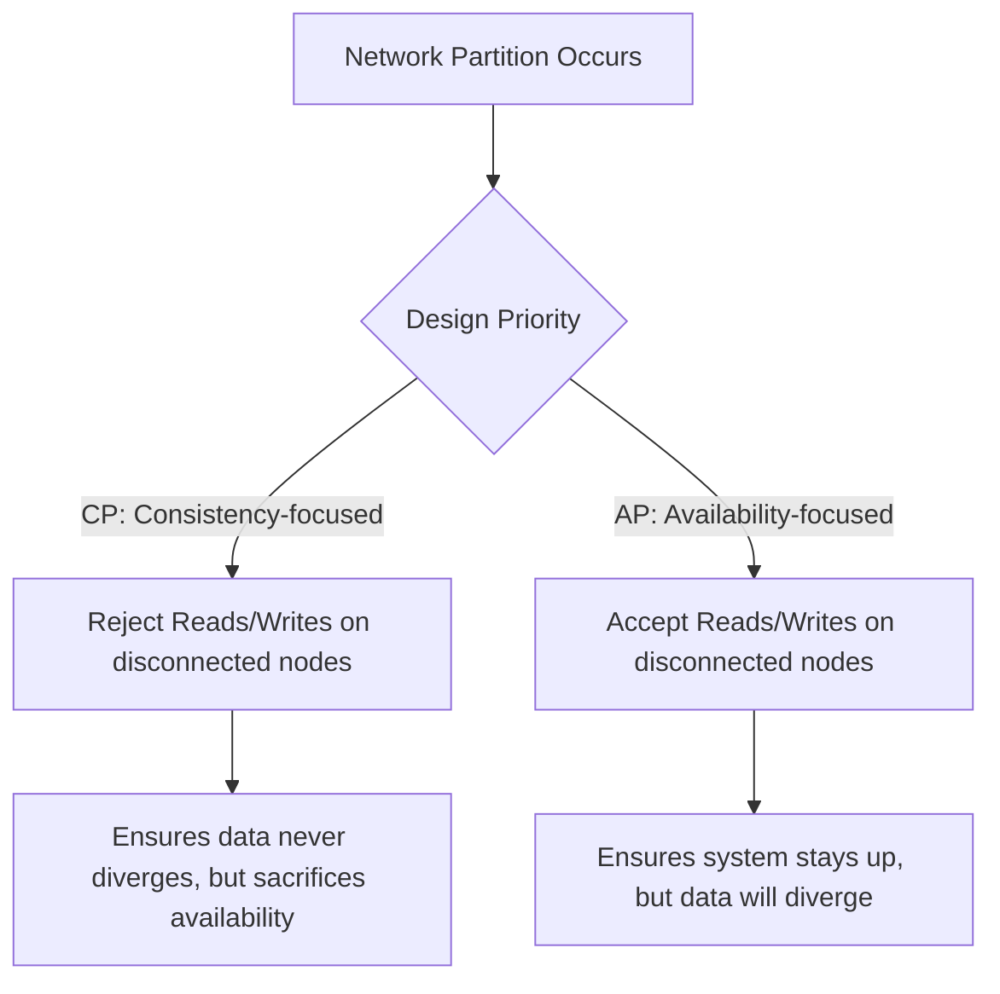
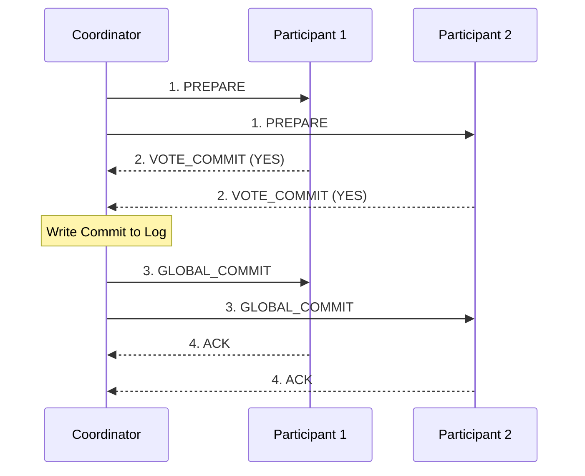

# Chapter 9: Consistency and Consensus

## 🎯 Core Thesis
Consensus is the most fundamental problem in distributed systems: it is the process of getting a group of independent, unreliable computers to agree on a single value or state. Solving consensus allows us to build reliable, strongly consistent systems (like distributed databases, locks, and service registries) even when the underlying network and hardware are highly unstable.

---

## 🔑 Key Terminology

*   **Linearizability (Strong Consistency)**: A guarantee that the database behaves *as if* there is only a single copy of the data, and all operations are executed atomically. Once a write is completed, all subsequent reads must return the new value.
*   **CAP Theorem**: A principle stating that in the event of a **Network Partition (P)**, a distributed system must choose between **Consistency (C - Linearizability)** and **Availability (A - every non-failing node returns a non-error response)**.
*   **Two-Phase Commit (2PC)**: An atomic commitment protocol that guarantees that a transaction across multiple database nodes either commits on all nodes or aborts on all nodes.
*   **Total Order Broadcast**: A protocol requiring that all messages are delivered in the exact same order to all nodes in a cluster. This is equivalent to solving distributed consensus.
*   **Split-Brain**: A condition where a single cluster splits into two independent partitions due to network issues, and both partitions elect their own leader, leading to data divergence.
*   **Paxos / Raft**: State-of-the-art consensus algorithms designed to safely manage replicated state machines under failure conditions.

---

## ⚖️ CAP Theorem: The Reality of Partitions

The CAP theorem is often misunderstood as "choose 2 out of 3." In practice, **Partitions (P)** are network faults and cannot be chosen; they are a physical reality of networking. Therefore, the choice is exclusively between:

*   **CP (Consistent under Partition)**: If a node cannot communicate with the leader, it refuses to serve requests to prevent returning stale data. The system is consistent but unavailable.
*   **AP (Available under Partition)**: Disconnected nodes continue to accept reads and writes, accumulating local updates. When the partition heals, data must be reconciled (highly prone to conflicts).

---

## 🤝 Distributed Transactions: Two-Phase Commit (2PC)

To guarantee transaction atomicity across multiple database partitions, we use **2PC**. It introduces a new component called the **Coordinator** (or Transaction Manager).

### The 2PC Flow:
1.  **Phase 1: Prepare Phase**:
    *   The Coordinator assigns a globally unique transaction ID.
    *   It sends a `PREPARE` request to all participant database nodes, asking if they can commit the transaction.
    *   Each participant checks constraints, acquires locks, writes to disk, and votes: `YES` (committed to saving) or `NO` (abort).
2.  **Phase 2: Commit Phase**:
    *   If **all** participants voted `YES`, the Coordinator writes a commit record to its local disk and sends a `COMMIT` command to all nodes. The transaction is officially committed.
    *   If **any** participant voted `NO` (or the coordinator timed out), the Coordinator sends an `ABORT` command to all nodes, and all participants roll back their locks and changes.

> [!CAUTION]
> **The 2PC Coordinator Bottleneck**:
> 2PC is a blocking protocol. If the Coordinator crashes *after* participants vote `YES` but *before* sending the `COMMIT`/`ABORT` command, participants are left in a "doubt" state. They cannot release their locks or abort the transaction because they don't know the global outcome, paralyzing the database partitions.

---

## 🗳️ Consensus Algorithms (Paxos, Raft, Zab)

Modern fault-tolerant consensus algorithms (like Raft used in etcd/Consul, or Paxos) solve the coordinator failure issue by using a **quorum of nodes** to make decisions.

### Core Mechanics of Raft/Paxos:
1.  **Epoch Numbers (or Term Numbers)**: In every term, there is a single leader. If the leader fails, a new term starts, and a new leader election is triggered.
2.  **Fencing Leader Checks**: If a stale leader attempts to send commands, nodes reject it because they have already joined a higher term/epoch number.
3.  **Quorum Commit**: A leader cannot commit a state change unless it receives confirmation from a **majority (quorum)** of nodes (e.g., at least 3 out of 5 nodes). This guarantees that even if 2 nodes crash, the remaining 3 hold the latest state and can elect a new leader without losing committed data.
