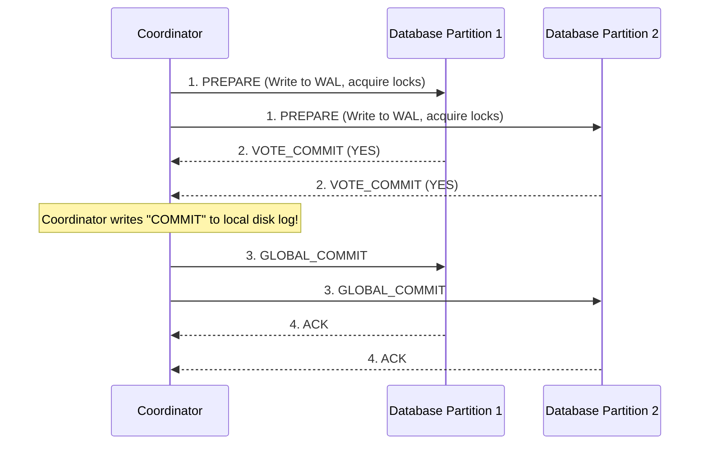
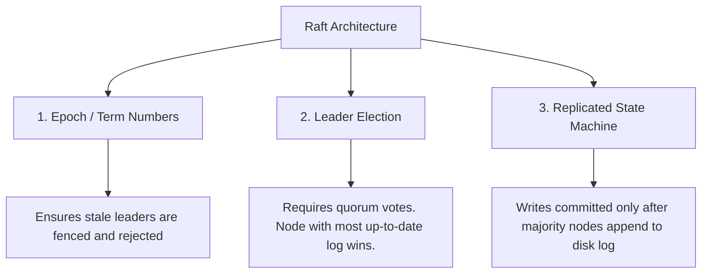

# Chapter 9: Consistency and Consensus (Interview-Grade Deep Dive)

## 🎯 Core Thesis
Consensus is the ultimate summit of distributed systems engineering. It is the process of getting a group of independent, unreliable physical machines to agree on a single state or sequence of operations. Solving consensus enables us to build strongly consistent, fault-tolerant distributed databases (like **CockroachDB**, **etcd**, and **ZooKeeper**) that can dynamically survive node crashes, network drops, and leader failovers without losing data or corrupting state.

---

## 🔑 Key Terminology & Academic Definitions

*   **Linearizability (Strong Consistency)**: A transaction isolation model guaranteeing that the database behaves *as if* there is only one copy of the data, and all operations are executed atomically. Once a write completes, all subsequent reads must return that new value.
*   **CAP Theorem**: An architectural principle stating that in the presence of a **Network Partition (P)**, a system must choose between **Consistency (C - Linearizability)** and **Availability (A - non-error responses from all healthy nodes)**.
*   **PACELC Theorem**: An extension of CAP. If there is a **Partition (P)**, trade off **Availability (A)** vs. **Consistency (C)**; **Else (E)** under normal operation, trade off **Latency (L)** vs. **Consistency (C)**.
*   **Two-Phase Commit (2PC)**: A blocking distributed transaction protocol guaranteeing atomic commitment across multiple database partitions (requires unanimous $100\%$ agreement).
*   **Consensus Algorithm (Raft/Paxos)**: A non-blocking replicated state machine protocol that achieves agreement as long as a **majority (quorum)** of nodes are functional.
*   **Total Order Broadcast**: A protocol ensuring that all nodes in a cluster receive and process the exact same sequence of messages in the exact same order. This is mathematically equivalent to solving distributed consensus.

---

## ⚖️ Beyond CAP: The PACELC Real-world Trade-Off

In interviews, demonstrating knowledge of **PACELC** immediately sets you apart from junior engineers who only cite CAP:

```text
PACELC Decision Flowchart:
─────────────────────────────────────────────────────────────────────────────
Is there a network Partition (P)?
 ├── YES ──> Choose between Availability (A) and Consistency (C).
 │           (AP vs. CP)
 │
 └── NO (Else - E) ──> Choose between Latency (L) and Consistency (C).
                       (EL vs. EC)
─────────────────────────────────────────────────────────────────────────────
```

### The PACELC Categories:
1.  **PC/EC (e.g., Google Spanner, MongoDB)**: In a partition, they choose Consistency (rejecting writes on isolated nodes). Under normal operation, they choose Consistency (forcing reads to hit the leader, paying a latency penalty).
2.  **PA/EL (e.g., Cassandra, DynamoDB)**: In a partition, they remain available. Under normal operation, they utilize asynchronous replication to achieve low latency, sacrificing strong consistency.

---

## 🤝 Distributed Transactions: Two-Phase Commit (2PC)

2PC is used to coordinate transactions that span **multiple database partitions** on different physical nodes.

### The 2PC Sequence Flow:



### The Blocking Coordinator Vulnerability
The core danger of 2PC is that it is a **blocking protocol**. 
*   If a participant votes `YES` in Phase 1, it enters a **Doubt State**. It cannot unilaterally abort or commit because it does not know the global consensus. It must hold all exclusive database locks indefinitely.
*   If the Coordinator **crashes** immediately after receiving the votes but before sending the `GLOBAL_COMMIT` command, the participant nodes are frozen. They must wait for the Coordinator to recover and read its disk log, blocking all other transactions in the database.

---

## 🗳️ Modern Consensus: Paxos and Raft

Modern consensus engines (like **Raft** in `etcd` or **Zab** in `ZooKeeper`) solve the blocking coordinator problem. They do not require unanimous agreement; they only require a **majority quorum** (e.g., 3 out of 5 nodes).

### Core Mechanics of Raft Consensus:



1.  **Epoch/Term Numbers**: Time is divided into terms. Each term has a single leader. If a node claims to be the leader but has an older term number, other nodes reject its commands. This prevents **Split-Brain** anomalies.
2.  **Non-blocking Recovery**: If the leader crashes, the remaining nodes detect the missing heartbeats, start a new term, and elect a new leader. As long as a majority ($3$ out of $5$) are alive, the cluster is fully writable.

### Guaranteeing Linearizable Reads (Preventing Stale Reads)
Even in a consensus cluster, a follower node that has lagged behind in replication might serve stale reads to a client.
*   *Solution 1: Read-Index Protocol*: When a leader receives a read request, it pings a majority of nodes to confirm it is still the active leader, verifies the highest committed index, and returns the data.
*   *Solution 2: Lease Reads*: The leader is granted a timed lease by the followers. During this lease, it can serve reads directly without pinging followers, reducing read latency.

---

## 🏆 System Design Interview Playbook: Consensus in Practice

When designing highly consistent architectures, use this playbook to justify consensus engines:

```text
Consensus Selection Playbook:
─────────────────────────────────────────────────────────────────────────────
Do you need a highly consistent metadata storage, distributed lock manager, 
or configuration registry (e.g., service discovery, leader elections)?
 └── YES ──> Choose etcd (Raft) or ZooKeeper (Zab).
             Justification: They implement Total Order Broadcast and linearizable 
             state machines, guaranteeing safe lock coordination and dynamic 
             leader registration.

Do you need to scale out a relational database globally while guaranteeing 
strict transaction serializability across separate shards?
 └── YES ──> Choose CockroachDB (Multi-Raft) or Google Spanner.
             Justification: They partition the database into small ranges 
             and run a separate, highly efficient Raft consensus group 
             for each individual range.
─────────────────────────────────────────────────────────────────────────────
```
